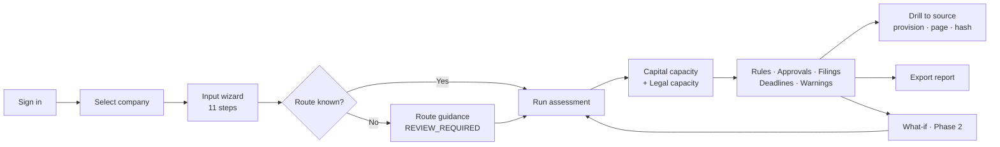
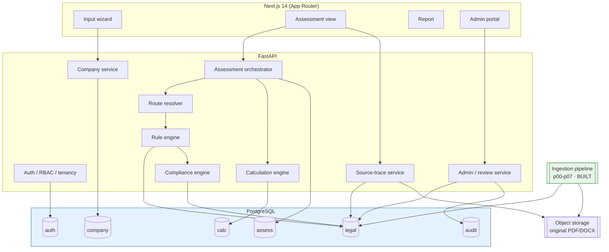
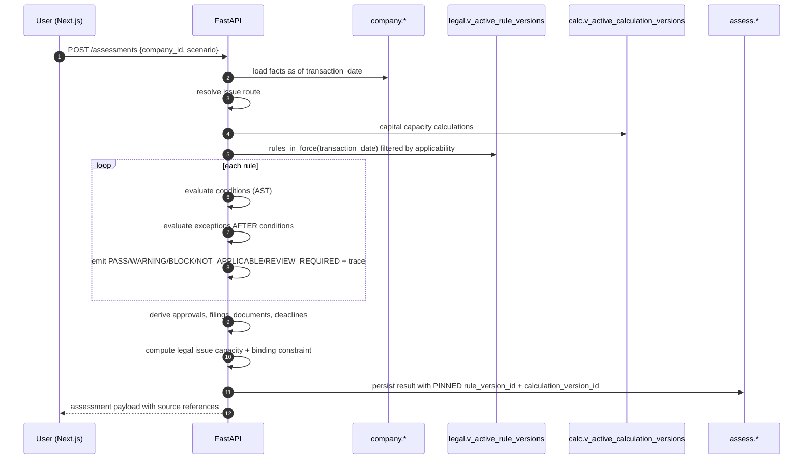
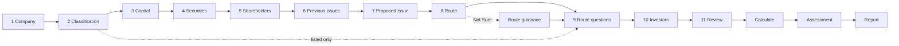
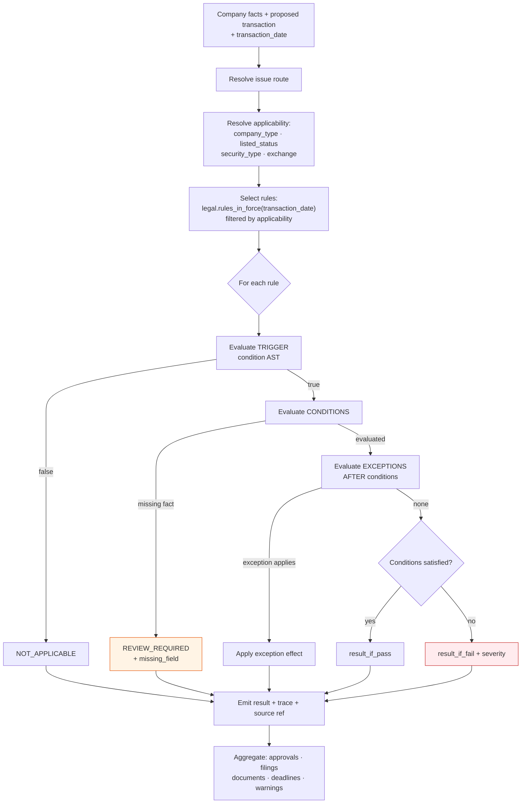
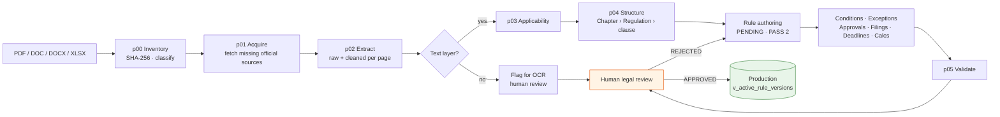
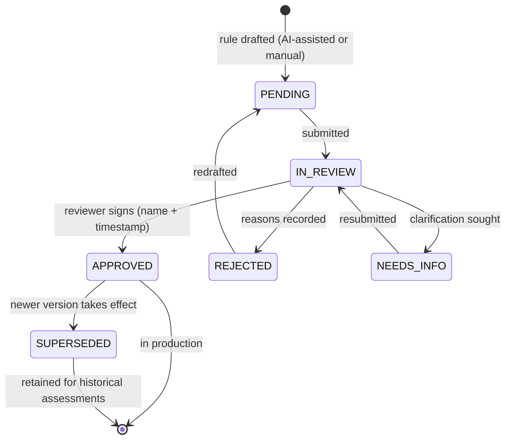
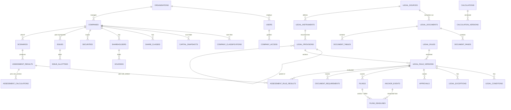
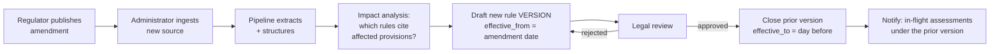
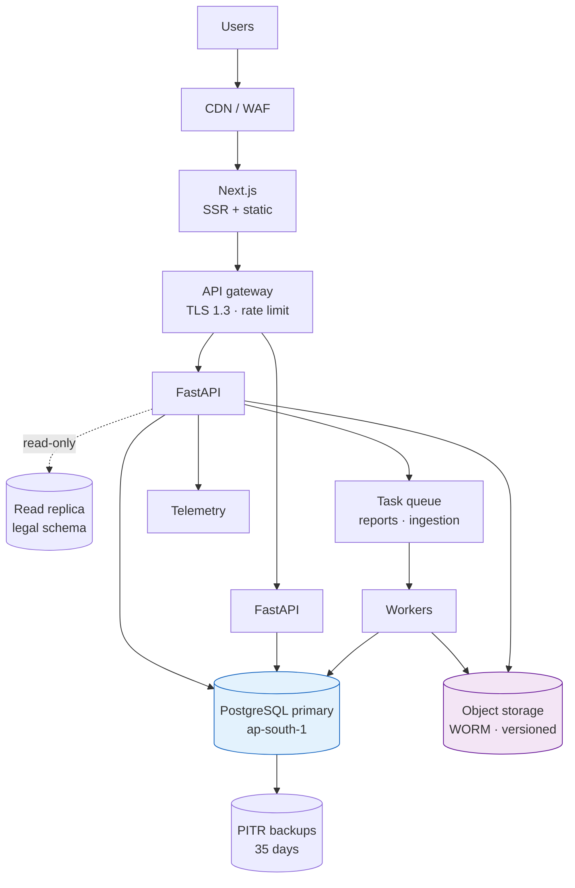

# Product Requirements Document
## Corporate Securities Issue Assessment, Compliance & Calculation Platform

| | |
|---|---|
| **Document status** | Draft for review |
| **Version** | 1.0 |
| **Date** | 2026-09-07 |
| **Stack** | Next.js (frontend) · FastAPI (backend) · PostgreSQL (primary datastore) |
| **Audience** | Product management, software engineering, database engineering, legal & compliance, UI/UX |
| **Jurisdiction** | India — MCA / Companies Act 2013 / SEBI / NSE / BSE |

> **Read this first.** The legal knowledge base described in §13, §20, §21 and §28 is **already built and running** (45 tables, 7,454 page-anchored provisions, migrations `001`–`006`, 38 passing tests). This PRD specifies what remains: rule authoring, the engines, the API, the frontend, authentication, tenancy and the admin portal. Sections that describe existing components say so explicitly and cite the real table, view or function so nobody re-specifies working code.
>
> **This document does not contain legal advice and does not state any legal requirement as fact.** Every legal rule referenced here is a structural placeholder. Legal substance enters the system only through the verified source database, and only after a qualified human reviewer approves it.

---

## Table of contents

**Foundation** — [1. Overview](#1-product-overview) · [2. Problem](#2-problem-statement) · [3. Vision](#3-product-vision) · [4. Objectives](#4-objectives) · [5. Goals](#5-goals) · [6. Non-Goals](#6-non-goals)

**Users** — [7. Target Users](#7-target-users) · [8. Personas](#8-user-personas) · [9. Journeys](#9-user-journeys)

**Product** — [10. Functional Requirements](#10-functional-requirements) · [11. Input Form](#11-input-form-requirements) · [12. Issue Routes](#12-issue-route-requirements)

**Engines** — [13. Legal Knowledge Base](#13-legal-knowledge-base) · [14. Rule Engine](#14-rule-engine) · [15. Calculation Engine](#15-calculation-engine) · [16. Compliance Engine](#16-compliance-engine) · [17. Assessment Engine](#17-assessment-engine) · [18. Explainability](#18-explainability) · [19. What-If Simulator](#19-what-if-simulator)

**Platform** — [20. Document Processing](#20-legal-document-processing) · [21. Database Architecture](#21-database-architecture) · [22. API](#22-api-requirements) · [23. Admin Portal](#23-admin-portal) · [24. Legal Review Workflow](#24-legal-review-workflow)

**Assurance** — [25. Security](#25-security) · [26. Auditability](#26-auditability) · [27. Version Control](#27-version-control) · [28. Data Model](#28-data-model)

**Experience** — [29. UI/UX](#29-uiux-requirements) · [30. Notifications](#30-notifications) · [31. Reporting](#31-reporting)

**Delivery** — [32. NFRs](#32-non-functional-requirements) · [33. MVP Scope](#33-mvp-scope) · [34. Future Scope](#34-future-scope) · [35. User Stories](#35-user-stories) · [36. Acceptance Criteria](#36-acceptance-criteria) · [37. Edge Cases](#37-edge-cases) · [38. Error Handling](#38-error-handling) · [39. Test Strategy](#39-test-strategy) · [40. Data Migration](#40-data-migration-strategy) · [41. Rule Updates](#41-legal-rule-update-strategy) · [42. Deployment](#42-deployment-architecture) · [43. Monitoring](#43-monitoring) · [44. Risks](#44-risks) · [45. Dependencies](#45-dependencies) · [46. Success Metrics](#46-success-metrics) · [47. Roadmap](#47-future-roadmap)

**Appendices** — [A. Worked Example](#appendix-a--worked-example-end-to-end) · [B. Sample Output](#appendix-b--sample-assessment-output) · [C. Requirement Index](#appendix-c--requirement-index)

---

# 1. Product Overview

The platform is a **Corporate Securities Issue Assessment, Compliance & Calculation Platform** for Indian companies proposing to issue additional shares or securities.

A user enters the company's current corporate and capital structure and the transaction it is contemplating. The platform then:

1. computes how many securities fit inside the company's **authorised capital** (arithmetic);
2. identifies the applicable **issue route** and whether the company qualifies for it;
3. evaluates the **legal and regulatory conditions** attaching to that route from a version-controlled rules database;
4. performs the **financial and capital calculations** the route requires;
5. derives the **approvals, documents, filings and deadlines** that follow;
6. produces an **explainable assessment** in which every conclusion traces to an exact provision, page and source document.

It is deliberately not a share calculator. A calculator answers *how many shares fit*. This platform separates that from *what the company may lawfully issue, on what conditions* — and shows its working for both.

### What already exists

| Component | Status | Evidence |
|---|---|---|
| Source corpus, hashed and preserved read-only | **Built** | 53 documents, SHA-256 verified on every pipeline run |
| Text extraction with page anchoring | **Built** | 1,176 pages, 26,674 blocks, 208 tables, 0 failures |
| Provision tree (Chapter → Regulation → clause) | **Built** | 7,454 provisions in `legal.legal_provisions` |
| PostgreSQL schema — legal, company, calc, assess, audit | **Built** | Migrations `001`–`006`, 45 tables, 7 views |
| Condition evaluator (AST) | **Built** | `pipeline/lib/conditions.py`, 24 tests |
| Database-enforced safety guarantees | **Built** | `db/tests/constraint_tests.sql`, 10 negative tests |
| **Authored legal rules** | **Not started** | `legal.v_active_rule_versions` returns 0 rows |
| **Rule / calculation / compliance engines** | **Not started** | This PRD |
| **FastAPI service, Next.js app, auth, tenancy** | **Not started** | This PRD |

---

# 2. Problem Statement

When an Indian company wants to issue additional shares, answering "can we?" today requires a professional to hold several things in their head at once: the Companies Act and its Rules, the company's own authorised-capital headroom, SEBI regulations if listed, the relevant exchange's checklists, and the approval/filing/deadline chain that follows. The work is slow, repeated per client, and its reasoning is not recorded.

Five specific failures result.

**Capital headroom is mistaken for legal permission.** A spreadsheet showing ₹30,00,000 of unused authorised capital says nothing about whether the company may issue against it through the chosen route. Conflating the two is the single most common and most expensive error the product exists to prevent.

**Advice is unauditable.** A conclusion delivered as a memo cannot later be reconstructed: which rule applied, which version of it, what the company's numbers were on that date. When a transaction is questioned months later, the reasoning is gone.

**The law moves and the answer silently rots.** SEBI amends ICDR; MCA substitutes a section. Advice given correctly in 2023 may be wrong in 2026, and nothing flags it. A worked example from this corpus: ICDR reg.164(1) carries the gazette amendment marker `305[90 trading days]` — the pricing reference period was substituted by amendment. Any tool holding the superseded figure would be confidently wrong.

**Route selection is opaque to the company.** Founders frequently do not know whether their transaction is a preferential issue or a private placement, and the distinction changes almost everything downstream.

**Generic AI tools are unsafe here.** A language model will produce a fluent, plausible and unsourced answer about Indian securities law. For a compliance decision that is worse than no answer, because it is confident. The product's defining constraint is that no legal outcome is ever generated — outcomes are looked up from human-approved rules and evaluated deterministically.

---

# 3. Product Vision

> A company enters its capital structure and proposed transaction. The platform returns its capital capacity, the applicable issue route, every legal condition attaching to that route, the calculations, the approvals, documents, filings and deadlines — and for every single conclusion, the exact provision, page and document it came from.

The platform must be able to answer, with sources:

| Question | Answered by |
|---|---|
| How many shares can we issue against authorised capital? | Calculation engine (§15) |
| Can we issue the proposed number? | Assessment engine — capital *and* legal capacity (§17) |
| Which route applies, and do we qualify? | Route resolver (§12) + rule engine (§14) |
| Which Companies Act / MCA Rules / SEBI / NSE / BSE provisions apply? | Rule engine over the knowledge base (§13) |
| What approvals, documents and filings are needed, and by when? | Compliance engine (§16) |
| What are the post-issue capital, dilution, premium, entitlement? | Calculation engine (§15) |
| What is preventing us from issuing more? | Binding-constraint analysis (§17) |
| What assumptions were made, and why this result? | Explainability layer (§18) |

**The product's central discipline:** it never answers "yes, you can issue X shares." It answers "the company has capital capacity for X; the proposed issue is subject to the following conditions, approvals and filings; here is each one and its source."

---

# 4. Objectives

| # | Objective | Measured by |
|---|---|---|
| O1 | Separate capital capacity from legal issue capacity in every output | No API response or UI surface presents a single unqualified issuable number (§36 AC-1) |
| O2 | Make every legal conclusion traceable to provision, page and document hash | 100% of rule results carry a resolvable source reference |
| O3 | Keep AI out of the legal decision path | Production reads only `legal.v_active_rule_versions`; approval requires a named human reviewer |
| O4 | Make historical assessments reproducible | Re-running a stored assessment yields identical output via pinned rule and calculation versions |
| O5 | Cover Rights, Preferential and Private Placement end-to-end | Each route passes its acceptance test suite (§36) |
| O6 | Surface uncertainty rather than guessing | Missing facts produce `REVIEW_REQUIRED`, never a defaulted answer |
| O7 | Let legal rules be updated without code deployment | Rule change is a data operation through the admin portal (§41) |

---

# 5. Goals

**Product goals**
- A company user completes an assessment in under 15 minutes without legal training.
- Every result is expandable from a one-line status to the underlying provision text.
- A professional can export a report suitable for a client file.

**Engineering goals**
- Deterministic engines: identical inputs and transaction date always give identical output.
- Legal content lives in data, not code.
- The database enforces the safety-critical invariants, so an application bug cannot approve an unreviewed rule.

**Compliance goals**
- Every assessment reconstructable years later (§26).
- Every rule attributable to a named reviewer and a dated source.
- Amendment-aware: the rule version applicable to the transaction date is the one used.

---

# 6. Non-Goals

| Not doing | Why |
|---|---|
| Giving legal advice or a legal opinion | The platform reports rules and their evaluation; a qualified professional advises |
| Auto-deciding legal permissibility where interpretation is required | Returns `REVIEW_REQUIRED` and routes to a human |
| Filing forms with MCA, SEBI, NSE or BSE | Out of scope; the platform tells you what to file and by when |
| Free-text legal Q&A / chatbot over the corpus | Unsourced generation is the failure mode the product exists to avoid |
| Foreign jurisdictions, FEMA/ODI, cross-border securities | Out of scope for MVP and Phase 2 |
| Company secretarial record-keeping / registers | Adjacent product |
| Valuation | The platform records that a valuation is required and captures its output; it does not value |
| REIT/InvIT units | Different legal regime; 14 corpus documents are inventoried but deferred (`scope='REIT_INVIT'`) |

---

# 7. Target Users

| Segment | Primary need | MVP priority |
|---|---|---|
| CA / CS / law firms managing many clients | Repeatable, sourced, exportable assessments | **Primary** |
| Company Secretary (in-house) | Approvals, filings, timelines | **Primary** |
| CFO / finance team | Capital, dilution, pricing, consideration | **Primary** |
| Founder / company user | Plain answer: can we, and what's involved | Secondary |
| Legal / compliance professional | Sources, exceptions, auditability | **Primary** |
| Platform administrator / legal reviewer | Rule authoring, review, versioning | **Internal, MUST** |

The tenancy model follows the primary segment: an **organisation** (firm) holds many **companies**, and users are granted access per company (§25).

---

# 8. User Personas

### P1 — Meera, Company Secretary at a CS firm
Manages 40 client companies. Runs several preferential issues a quarter. Lives in checklists and deadlines; her risk is a missed filing.
- **Needs:** approvals, filings, deadlines anchored to real events; per-client separation; exportable report.
- **Pain today:** re-reading the same NSE checklist for every client; tracking dates in a spreadsheet.
- **Success:** the compliance timeline for a transaction, dated from its own anchor events, in one click.

### P2 — Rahul, CFO of an unlisted public company
Raising a round. Cares about dilution and whether the board's proposed number is even possible.
- **Needs:** capital capacity, post-issue cap table, dilution per shareholder, premium and consideration.
- **Pain today:** a spreadsheet nobody has audited.
- **Success:** understands within minutes that authorised capital is the binding constraint and that increasing it is a prerequisite step.

### P3 — Anjali, partner at a law firm
Signs off. Will not rely on any tool that cannot show its source.
- **Needs:** provision text, page, effective date, version; explicit assumptions and exceptions.
- **Pain today:** re-deriving the same analysis; no institutional memory.
- **Success:** clicks a rule, sees the ICDR provision, page 129, effective date, version — and disagrees or accepts on the record.

### P4 — Vikram, founder
Does not know a preferential issue from a private placement.
- **Needs:** guided input, plain language, "Not Sure" route option.
- **Success:** learns which routes may be relevant and what he must ask his CS.

### P5 — Priya, legal reviewer (internal)
Approves rules before they reach production. Accountable for what the platform says.
- **Needs:** side-by-side draft rule and source provision; approve/reject with reasons; version history.
- **Success:** no rule reaches production without her name and timestamp on it.

### P6 — Sameer, platform administrator (internal)
Ingests new documents, monitors quality, manages amendments.
- **Needs:** upload → extract → structure → review queue; conflict detection; change log.
- **Success:** a SEBI amendment becomes a new rule version with correct effective dates, old version closed, no overwrite.

---

# 9. User Journeys

### J1 — Assessment (P1/P2, the core journey)
1. Sign in → select client company (or create one).
2. Wizard: company → classification → capital → securities → shareholders → previous issues → proposed issue → route → route-specific → investors → review.
3. Submit → assessment runs.
4. **Result screen leads with two numbers:** capital capacity and legal issue capacity, never merged.
5. Expand any rule → status, plain-English reason, provision, page, source, version.
6. Review approvals, documents, filings, deadlines, warnings, assumptions.
7. Export report; assessment is stored immutably with pinned versions.

### J2 — Route discovery (P4)
Selects "Not Sure" → system uses entered facts to explain which routes may be relevant and what distinguishes them → **stops short of a final legal determination**, flags `REVIEW_REQUIRED`, and recommends professional confirmation.

### J3 — What-if (P2, Phase 2)
From a completed assessment, changes share count / price / ratio / route → recalculation → side-by-side diff of capacity, dilution, rules, approvals, filings.

### J4 — Rule authoring and review (P5/P6, internal)
Admin ingests document → pipeline extracts and structures → drafter creates rule anchored to a provision → status `PENDING` → reviewer compares against source → `APPROVED` with name and timestamp, or `REJECTED` with reasons → only then does it enter `legal.v_active_rule_versions`.

### J5 — Amendment (P6, internal)
Regulator amends a provision → new source ingested → affected rules flagged → new rule **version** created with `effective_from` = amendment date; prior version's `effective_to` closed → assessments before that date still resolve to the old version (§27).



---

# 10. Functional Requirements

## 10.1 System architecture



Green = already built. The FastAPI layer is the only writer to `assess.*`; the pipeline and admin service are the only writers to `legal.*`.

## 10.2 Data flow — one assessment



## 10.3 Core functional requirements

#### FR-CORE-001 — Dual-capacity output `MUST`
| | |
|---|---|
| **Description** | Every assessment reports **capital capacity** and **legal issue capacity** as separate, separately-explained figures. Legal issue capacity is never inferred from authorised-capital headroom alone. |
| **Inputs** | Capital snapshot; proposed issue; evaluated rule results |
| **Processing** | Capital capacity from `calc` formulas. Legal issue capacity = capital capacity constrained by every `BLOCK` result and route-specific ceiling; if any applicable rule is `REVIEW_REQUIRED`, legal capacity is returned as *indeterminate*, not as a number |
| **Output** | `{capital_capacity, legal_issue_capacity, binding_constraint, indeterminate_reasons[]}` |
| **Dependencies** | FR-CALC-001, FR-RULE-001, FR-ASMT-001 |
| **Acceptance** | No endpoint or screen renders a single unqualified "you can issue N shares"; when a rule blocks, `binding_constraint` names the rule and its source |
| **Priority** | MUST |

#### FR-CORE-002 — Determinism `MUST`
| | |
|---|---|
| **Description** | Identical company facts + scenario + transaction date produce byte-identical assessment output. |
| **Processing** | No randomness, no wall-clock reads inside evaluation, no LLM call in the request path. Version selection is by `transaction_date`, not run date |
| **Output** | Stable assessment payload |
| **Dependencies** | FR-VER-001 |
| **Acceptance** | Re-running a stored assessment reproduces its rule results and calculation outputs exactly (§39 test `test_assessment_reproducible`) |
| **Priority** | MUST |

#### FR-CORE-003 — Production rules only `MUST`
| | |
|---|---|
| **Description** | The engine reads exclusively from `legal.v_active_rule_versions` (`APPROVED` + within validity + no unresolved conflict). |
| **Processing** | Direct reads of `legal.legal_rule_versions` from request-path code are prohibited and caught in code review + a lint rule |
| **Dependencies** | Existing view; §24 |
| **Acceptance** | With zero approved rules the engine returns a well-formed assessment whose legal section states that no approved rules cover the route — it must not fail, and must not fall back to unapproved rules |
| **Priority** | MUST |

#### FR-CORE-004 — Unknown facts never default `MUST`
| | |
|---|---|
| **Description** | A rule needing a fact the user did not supply yields `REVIEW_REQUIRED` naming the missing field. |
| **Processing** | `pipeline/lib/conditions.py` raises `UnknownFact`; the engine maps it to `REVIEW_REQUIRED` with `missing_field`. Absent ≠ false |
| **Output** | Rule result with `status=REVIEW_REQUIRED`, `missing_field`, and a wizard deep-link to supply it |
| **Dependencies** | Existing evaluator (already tested: `test_missing_fact_is_not_false`) |
| **Acceptance** | Omitting a required input never silently changes a `BLOCK` into a `PASS` |
| **Priority** | MUST |

#### FR-CORE-005 — Multi-tenant isolation `MUST`
| | |
|---|---|
| **Description** | An organisation's company data is invisible to every other organisation. |
| **Processing** | `org_id` on all `company.*` and `assess.*` rows; PostgreSQL row-level security keyed to a session variable set per request from the authenticated principal |
| **Dependencies** | FR-SEC-001, migration `007` |
| **Acceptance** | A penetration test attempting cross-org access by ID enumeration returns 404, and RLS blocks it even if the API layer is bypassed |
| **Priority** | MUST |

#### FR-CORE-006 — Assessment immutability `MUST`
| | |
|---|---|
| **Description** | A stored assessment is never mutated. Re-running creates a new assessment. |
| **Processing** | `assess.assessment_results` is insert-only; inputs frozen into `inputs_snapshot` |
| **Acceptance** | No `UPDATE` path exists on assessment tables; audit log shows only inserts |
| **Priority** | MUST |

---

# 11. Input Form Requirements

An 11-step wizard feeding a 3-step outcome (review → calculate → assessment → report). Steps are **conditional**: a private unlisted company never sees exchange questions.



#### FR-INP-001 — Company identification `MUST`
| | |
|---|---|
| **Description** | Capture and validate company identity. |
| **Inputs** | CIN, name, registered office, incorporation date, status |
| **Processing** | CIN validated against the 21-character structural pattern already enforced by `company.companies.cin_shape`; listing status derives the exchange sub-form. **Format validation only — no claim of registry verification** |
| **Output** | `company.companies` row scoped to `org_id` |
| **Dependencies** | Existing `company.companies` |
| **Acceptance** | Malformed CIN rejected inline with the expected format; valid CIN persists; duplicate CIN within an org warns rather than blocks (companies may be re-registered) |
| **Priority** | MUST |

#### FR-INP-002 — Company classification `MUST`
| | |
|---|---|
| **Description** | Capture the classification dimensions that drive rule applicability. |
| **Inputs** | Private/public; listed/unlisted; NSE / BSE / both; SME or main board; ISIN; symbol; special classes (Section 8, Nidhi, government) |
| **Processing** | Written to `company.company_classifications` with `effective_from`; the table's `EXCLUDE` constraint already prevents overlapping classification periods |
| **Output** | Classification effective at the transaction date |
| **Dependencies** | `legal.company_type`, `legal.listed_status`, `legal.exchange` enums |
| **Acceptance** | Listed=true requires at least one exchange; BSE-listed company triggers the BSE coverage warning of FR-ASMT-006 |
| **Priority** | MUST |

#### FR-INP-003 — Existing capital structure `MUST`
| | |
|---|---|
| **Description** | Capture authorised / issued / subscribed / paid-up capital, face value and share counts, per class. |
| **Inputs** | Equity and preference blocks: four capital figures, face value, share counts |
| **Processing** | Persisted to `company.capital_snapshots`, which already enforces `issued ≤ authorised`, `subscribed ≤ issued`, `paid_up ≤ subscribed`. Derived share counts cross-checked against capital ÷ face value and mismatches surfaced (§37 EC-3) |
| **Output** | Capital snapshot as of a stated date |
| **Acceptance** | Violating the capital ordering is rejected with a message naming the two figures; a share-count/face-value mismatch raises a warning the user must acknowledge |
| **Priority** | MUST |

#### FR-INP-004 — Existing securities `MUST`
| | |
|---|---|
| **Description** | Capture instruments that may dilute or convert. |
| **Inputs** | Convertible preference, convertible debentures, warrants, ESOP/options, other convertibles; conversion terms and tenure |
| **Processing** | `company.securities` + `company.security_terms`; feeds fully-diluted calculations |
| **Acceptance** | A convertible with terms produces a fully-diluted share count distinct from the basic count |
| **Priority** | MUST |

#### FR-INP-005 — Shareholders and holdings `SHOULD`
| | |
|---|---|
| **Description** | Capture the cap table to the depth the route requires. |
| **Inputs** | Name, shares held, promoter/promoter-group, existing/new, related party, director, employee, institutional/QIB, public; PAN; demat status; lock-in |
| **Processing** | Ownership % computed, never entered (`shares_held / total × 100`). `company.holdings` already enforces `locked_in_shares ≤ shares_held` |
| **Output** | Pre-issue cap table; per-holder dilution basis |
| **Acceptance** | Percentages sum to 100 ± 0.01 or the mismatch is shown explicitly; a rights issue can proceed on aggregate figures without a full cap table, a preferential issue cannot (allottee data is required) |
| **Priority** | SHOULD (MUST for preferential/private placement) |

#### FR-INP-006 — Previous issue history `SHOULD`
| | |
|---|---|
| **Description** | Capture prior issues, because earlier transactions can condition current eligibility. |
| **Inputs** | Date, route, security type, count, face value, price, premium, allottees, investor category, conversion terms, approvals, filing status |
| **Processing** | `company.issues` + `company.issue_allottees`; exposed to the rule engine as facts (e.g. `company.previous_issues[]`) so rules that depend on issue history can be authored without code change |
| **Acceptance** | A rule can be authored against prior-issue facts without modifying engine code |
| **Priority** | SHOULD |

#### FR-INP-007 — Proposed issue `MUST`
| | |
|---|---|
| **Description** | Capture the transaction under consideration. |
| **Inputs** | Security type, number of securities, face value, issue price, premium, total amount, purpose, cash/non-cash, debt conversion, proposed issue and allotment dates |
| **Processing** | Premium and total derived and reconciled against any entered values; `transaction_date` selects rule and calculation versions |
| **Acceptance** | Entered total inconsistent with count × price is flagged before submission; premium is derived, not free-typed |
| **Priority** | MUST |

#### FR-INP-008 — Progressive disclosure and save/resume `MUST`
| | |
|---|---|
| **Description** | Show only fields relevant to the classification and route; allow resuming a partly-completed wizard. |
| **Processing** | Draft scenario persisted per step; validation runs per step and again on submit |
| **Acceptance** | A private unlisted company is never shown NSE/BSE fields; closing the browser mid-wizard loses nothing |
| **Priority** | MUST |

---

# 12. Issue Route Requirements

## 12.1 Routes

| Route | MVP | Phase | Notes |
|---|---|---|---|
| Rights Issue | ✅ | MVP | Strongest corpus coverage after preferential |
| Preferential Issue | ✅ | MVP | Best-covered route (ICDR Ch. V, FAQs, NSE checklists) |
| Private Placement | ⚠️ | MVP, **gated** | Primary law absent — see FR-ROUTE-004 and §45 |
| Bonus, ESOP, Sweat Equity | — | Phase 2 | Sweat equity/SBEB sources already in corpus |
| Public Issue, FPO, QIP | — | Phase 3 | FPO checklists present; ICDR public-issue chapters present |
| Conversion, Warrants, Other | — | Phase 3 | Schema already supports via `legal.issue_type` |

The `legal.issue_type` enum already contains all fourteen values, so adding a route is data and rule authoring — never a schema migration.

#### FR-ROUTE-001 — Route-conditional questioning `MUST`
| | |
|---|---|
| **Description** | Present only the questions the selected route requires. |
| **Inputs** | Selected route; company classification |
| **Processing** | A declarative route-question manifest per `issue_type` and `listed_status`, versioned with the app |
| **Output** | Route-specific input set |
| **Acceptance** | Rights shows ratio/record date/renunciation; preferential shows allottees/valuation/relevant date; private placement shows identified persons and count — and none shows the others' fields |
| **Priority** | MUST |

**Route-specific inputs**

| Rights Issue | Preferential Issue | Private Placement |
|---|---|---|
| Eligible shares; rights ratio; entitlement; renunciation permitted; additional shares applied for; record date; issue price; open/close dates; oversubscription treatment | Proposed allottees; existing-shareholder status; promoter/promoter-group; related party; security type; cash/non-cash; valuation report and basis; issue price; relevant date; special resolution date; purpose | Identified persons and count; investor category; security type; amount; price; separate bank account; purpose; status of any previous offer in the same financial year; proposed allotment date |

#### FR-ROUTE-002 — "Not Sure" route guidance `MUST`
| | |
|---|---|
| **Description** | When the user cannot identify the route, explain which routes may be relevant from the entered facts — without making the legal determination. |
| **Inputs** | Company classification; proposed issue; investor facts |
| **Processing** | Evaluates route *applicability* rules only. Produces a ranked shortlist with the distinguishing factors and what each route would require |
| **Output** | Candidate routes, each with rationale, distinguishing questions, and `status=REVIEW_REQUIRED` |
| **Dependencies** | FR-RULE-001 |
| **Acceptance** | Output never states a single route as the legally correct one; it always recommends professional confirmation and records the assumption |
| **Priority** | MUST |

#### FR-ROUTE-003 — Route eligibility `MUST`
| | |
|---|---|
| **Description** | Determine whether the company qualifies for the selected route. |
| **Processing** | Applicability rules evaluated before substantive rules; ineligibility yields `BLOCK` with the disqualifying condition and source |
| **Acceptance** | Selecting a route the company cannot use produces a blocking result naming the provision, not a silent empty assessment |
| **Priority** | MUST |

#### FR-ROUTE-004 — Private placement source gate `MUST`
| | |
|---|---|
| **Description** | Until the amended Companies Act is ingested and its rules approved, the private placement route returns `REVIEW_REQUIRED` for every legal conclusion while still performing all calculations. |
| **Processing** | Route flagged `source_gap=COMPANIES_ACT_2013` in the route manifest; the assessment's legal section states which sections are unsourced (23, 39, 42, 55, 62, 63, 117, 179(3)(c)) |
| **Output** | Full capital/dilution calculations + explicit statement that legal assessment is unavailable pending the primary source |
| **Dependencies** | §45 D1 |
| **Acceptance** | The route never returns `PASS` on a legal condition while the gate is set; the gate is removed by data (approving rules), not by a code change |
| **Priority** | MUST |

---

# 13. Legal Knowledge Base

**Status: built.** The corpus, extraction, provision tree and schema exist. This section documents what the engines consume and what remains to be authored.

## 13.1 Current corpus

| Priority | Meaning | Documents |
|---|---|---|
| **P0** | Primary law — Acts, Rules, Regulations | 10 |
| **P1** | Official regulatory material — circulars, master circulars, FAQs | 1 |
| **P2** | Official operational requirements — exchange checklists, forms, instruction kits | 39 |
| **P3** | Unclassified; may not be the sole basis for a rule | 3 |
| **P4** | General web | 0 |

P0 holds SEBI ICDR, LODR, SAST, PIT, SBEB & Sweat Equity, Depositories & Participants; MCA Share Capital & Debentures Rules, Prospectus & Allotment Rules, Management & Administration Rules, Registration Offices & Fees Rules.

A database trigger already refuses to approve any rule sourced from P3/P4 or from text marked `REFERENCE_ONLY`.

## 13.2 Source record

`legal.legal_sources` holds source_id, authority, document_type, title, file_name, version, publication/amendment/effective dates, official URL, **SHA-256 file hash**, retrieved date, source priority, consolidation status and `as_amended_upto`. The hash is the document's identity: same bytes, same source, whatever the file is called.

## 13.3 Provision anchoring

Every provision resolves to document + page + character offset. A real row from the database:

```
citation      SEBI (ICDR) Regulations, 2018 Chapter V Part IV reg.164(1)
page          129
file_name     SEBI ICDR Regulations.pdf
file_hash     db196f1f33dc… (SHA-256)
priority      P0
amendment     305[90 trading days]   ← gazette footnote marker: text substituted by amendment
```

**Design note carried forward from the build.** `citation` is human-readable and *not unique* — Schedules restart their numbering, so "Schedule Part I para 2" legitimately recurs. `citation_uid` is the unique key, and colliding citations are flagged `citation_ambiguous`. A quality check reports any rule anchored to an ambiguous citation.

## 13.4 Coverage and gaps

| Route | Documents | With primary law |
|---|---|---|
| Preferential | 16 | 6 |
| Rights | 12 | 6 |
| Private placement | 8 | 4 |

**Open gaps — these constrain MVP, see §44/§45:**

1. **Companies Act, 2013 absent.** Sections 23, 39, 42, 55, 62, 63, 117, 179(3)(c) have no source document. Every official channel refuses automated access (mca.gov.in returns HTTP 403 to scripted clients; indiacode.gov.in presents a hostname-mismatched certificate then serves a JavaScript shell). It must be supplied manually, and must be the text **as amended** — s.42 was wholly substituted by the Companies (Amendment) Act, 2017 w.e.f. 07-08-2018, so as-enacted text would produce wrong private-placement rules.
2. **BSE coverage thin.** Four documents acquired; BSE's further-issues page is an Angular application whose links cannot be scraped.
3. **Missing:** MCA form instruction kits (PAS-3, MGT-14, SH-7); SEBI circulars and master circulars; NSE circular NSE/CML/2023/51.
4. **ICDR pages 360–364 are scanned images** (Part E abridged prospectus formats), flagged for review rather than silently OCR'd. Public-issue scope, outside MVP.

#### FR-KB-001 — Source gap transparency `MUST`
| | |
|---|---|
| **Description** | An assessment states where a conclusion could not be reached because a source is missing. |
| **Processing** | Route manifests carry `source_gap` markers; the assessment surfaces them in `warnings[]` and `assumptions[]` |
| **Acceptance** | A private placement assessment names the Companies Act as the missing source rather than returning an empty legal section |
| **Priority** | MUST |

---

# 14. Rule Engine

Deterministic. No model inference in the request path.

## 14.1 Evaluation flow



**Ordering is normative:** trigger → conditions → *exceptions* → result. Exceptions are evaluated after conditions and can override the outcome, because a rule that applies but is excepted is not the same as a rule that never applied.

## 14.2 Condition language — already implemented

`pipeline/lib/conditions.py` is built and tested. The FastAPI engine **imports it; it does not reimplement it.**

Operators: `AND`, `OR`, `NOT`, `eq`, `ne`, `gt`, `gte`, `lt`, `lte`, `in`, `not_in`, `exists`, `not_exists`.

```json
{"op": "AND", "args": [
  {"op": "eq", "field": "company.listed",       "value": true},
  {"op": "eq", "field": "issue.type",           "value": "PREFERENTIAL"},
  {"op": "in", "field": "issue.security_type",  "value": ["EQUITY_SHARES", "WARRANTS"]}
]}
```

The same AST is validated in two places — a SQL `CHECK` calling `legal.validate_condition_ast()` and the Python `validate()`. An existing test asserts the two agree across eleven cases, because one contract with two implementations will otherwise drift.

#### FR-RULE-001 — Deterministic evaluation `MUST`
| | |
|---|---|
| **Description** | Evaluate applicable rules against company facts and emit a structured result per rule. |
| **Inputs** | Fact bundle; `transaction_date`; applicability dimensions |
| **Processing** | Version selection via `legal.rules_in_force(date)`; trigger → conditions → exceptions → result; full node-level trace retained |
| **Output** | `[{rule_code, rule_version_id, status, message, explanation, condition_trace, exception_applied, source_reference, source_page}]` |
| **Dependencies** | Existing evaluator; `legal.v_active_rule_versions` |
| **Acceptance** | Every emitted result carries a resolvable `rule_version_id` and source reference; identical inputs give identical output |
| **Priority** | MUST |

#### FR-RULE-002 — Exception handling `MUST`
| | |
|---|---|
| **Description** | Exceptions are evaluated after conditions and may change the result. |
| **Processing** | `legal.legal_exceptions` rows carry their own AST, `effect` and validity range; a matching exception's effect replaces the base result and is recorded in `exception_applied` |
| **Acceptance** | A rule whose exception applies reports the exception, its condition and its source — never a bare `NOT_APPLICABLE` |
| **Priority** | MUST |

#### FR-RULE-003 — Conflict safety `MUST`
| | |
|---|---|
| **Description** | Rules touched by an unresolved conflict are excluded from production and surfaced as `REVIEW_REQUIRED`. |
| **Processing** | `legal.v_active_rule_versions` already excludes rules with `OPEN`/`UNDER_REVIEW` conflicts; the engine reports the exclusion rather than staying silent |
| **Acceptance** | An open conflict on a rule produces a visible `REVIEW_REQUIRED` line, not a missing rule |
| **Priority** | MUST |

#### FR-RULE-004 — Evaluation trace `MUST`
| | |
|---|---|
| **Description** | Persist why each rule produced its result. |
| **Processing** | Node-level trace (`op`, `field`, `actual`, `expected`, `result`) stored in `assess.assessment_rule_results.condition_trace` |
| **Acceptance** | For a failed rule the UI can name the exact clause that failed and the actual value that failed it |
| **Priority** | MUST |

---

# 15. Calculation Engine

Separate from the rule engine, and separately versioned. A rule says *this condition applies*; a calculation says *compute X by formula Y*. They are linked, never merged.

## 15.1 MVP calculations

| Code | Calculation | Formula | Unit |
|---|---|---|---|
| `CALC-AUTH-SHARES` | Authorised shares | `authorised_capital / face_value` | shares |
| `CALC-AVAIL-SHARES` | Available authorised shares | `authorised_shares − issued_shares` | shares |
| `CALC-NOMINAL-INC` | Nominal capital increase | `new_shares × face_value` | ₹ |
| `CALC-CONSIDERATION` | Issue consideration | `new_shares × issue_price` | ₹ |
| `CALC-PREMIUM` | Premium per share / total | `issue_price − face_value`; `× new_shares` | ₹ |
| `CALC-POST-SHARES` | Post-issue shares | `existing_shares + new_shares` | shares |
| `CALC-OWNERSHIP` | Ownership % | `holder_shares / post_issue_shares × 100` | % |
| `CALC-DILUTION` | Dilution | `pre_issue_pct − post_issue_pct` | pp |
| `CALC-RIGHTS-ENT` | Rights entitlement | `eligible_shares × ratio_num / ratio_den` | shares |
| `CALC-POST-CAPITAL` | Post-issue paid-up capital | `paid_up + (new_shares × face_value)` | ₹ |
| `CALC-FULLY-DILUTED` | Fully diluted shares | `post_issue_shares + convertible_shares + outstanding_options` | shares |

#### FR-CALC-001 — Versioned, sourced calculations `MUST`
| | |
|---|---|
| **Description** | Every calculation is a versioned record with declared inputs, formula, output and unit. |
| **Inputs** | Named inputs declared in `calc.calculation_versions.required_inputs` (JSONB array) |
| **Processing** | Version selected by `transaction_date` via the same `daterange` + GiST exclusion pattern as rules; engine refuses to run on incomplete inputs rather than defaulting |
| **Output** | `{calc_code, formula, inputs, result, unit, calculation_version_id}` |
| **Acceptance** | A missing required input yields an explicit error naming the input, never a zero or a null result; `calculation_versions` cannot hold overlapping validity ranges (DB-enforced) |
| **Priority** | MUST |

#### FR-CALC-002 — Show the working `MUST`
| | |
|---|---|
| **Description** | Every displayed figure can be expanded to formula, substituted values and result. |
| **Output** | `Authorised shares = 50,00,000 / 10 = 5,00,000` |
| **Acceptance** | No number appears in the report without an expandable derivation |
| **Priority** | MUST |

#### FR-CALC-003 — Rounding and money handling `MUST`
| | |
|---|---|
| **Description** | Share counts are integers; money uses fixed-point decimal. |
| **Processing** | `NUMERIC` throughout — never floating point. `rounding_mode` and `decimal_places` are per calculation version. Fractional entitlements are reported as fractional with the rounding rule stated, never silently truncated |
| **Acceptance** | A 3:7 rights ratio on 1,000 shares reports the fraction and the applied rounding rule explicitly (§37 EC-5) |
| **Priority** | MUST |

#### FR-CALC-004 — Capital capacity vs legal capacity separation `MUST`
| | |
|---|---|
| **Description** | The calculation engine returns capital capacity only. It has no authority to state legal capacity. |
| **Acceptance** | The calculation service's response schema contains no field expressing legal permission |
| **Priority** | MUST |

---

# 16. Compliance Engine

Derives the operational consequences of the rules that fired.

#### FR-COMP-001 — Approvals `MUST`
| | |
|---|---|
| **Description** | List required approvals, each traced to the rule that causes it. |
| **Processing** | `legal.approvals` rows are FK-bound to `rule_version_id` — an approval cannot exist as free-floating text. Types available: board, shareholder ordinary/special, postal ballot, exchange in-principle/listing/trading, SEBI, RBI, ROC, audit committee |
| **Output** | `[{approval_type, name, authority, stage, caused_by_rule, source_reference}]` |
| **Acceptance** | Every listed approval names its causing rule and source |
| **Priority** | MUST |

#### FR-COMP-002 — Filings `MUST`
| | |
|---|---|
| **Description** | List required filings with form name, authority and trigger event. |
| **Processing** | `legal.filings.trigger_event` is a FK to `legal.anchor_events` — a filing without a trigger cannot be stored |
| **Acceptance** | Every filing has a trigger event; none carries a hardcoded date |
| **Priority** | MUST |

#### FR-COMP-003 — Compositional deadlines `MUST`
| | |
|---|---|
| **Description** | Deadlines are stored as anchor + offset + unit + day-type + direction, and computed per transaction. |
| **Processing** | "15 days after allotment" is stored as `anchor_event=ALLOTMENT_DATE, offset_value=15, offset_unit=DAYS, day_type=CALENDAR, direction=AFTER`. Computed by the existing `legal.compute_deadline()` |
| **Output** | `{event, anchor_event, anchor_date, computed_due_date, day_type, basis, source_reference}` |
| **Acceptance** | No fixed date is ever stored as a deadline. Changing the allotment date shifts every dependent deadline. `TRADING` day-type results are marked provisional pending an exchange holiday calendar (§37 EC-8) |
| **Priority** | MUST |

The 14 seeded anchor events: `BOARD_RESOLUTION_DATE`, `SHAREHOLDER_RESOLUTION_DATE`, `NOTICE_DISPATCH_DATE`, `RELEVANT_DATE`, `RECORD_DATE`, `OFFER_LETTER_DATE`, `IN_PRINCIPLE_APPROVAL_DATE`, `ISSUE_OPEN_DATE`, `ISSUE_CLOSE_DATE`, `ALLOTMENT_DATE`, `MONEY_RECEIPT_DATE`, `LISTING_APPROVAL_DATE`, `TRADING_APPROVAL_DATE`, `FINANCIAL_YEAR_END`.

#### FR-COMP-004 — Document requirements `MUST`
| | |
|---|---|
| **Description** | List documents required, by stage and necessity. |
| **Processing** | `legal.document_requirements`, keyed by rule + issue type + stage + authority + `MANDATORY`/`CONDITIONAL`/`OPTIONAL`. Exchange checklists express these as **table rows**, so `legal.document_tables` (208 grids already extracted) is the authoring input — not the prose parser |
| **Acceptance** | Each requirement names its stage, necessity and source; checklist-derived items link back to the exact grid |
| **Priority** | MUST |

#### FR-COMP-005 — Compliance timeline `SHOULD`
| | |
|---|---|
| **Description** | Order approvals, filings and documents into a dated sequence across the seven compliance stages. |
| **Processing** | Stages: `PRE_ISSUE → PRE_ALLOTMENT → ALLOTMENT → POST_ALLOTMENT → LISTING → TRADING → ONGOING` |
| **Output** | Gantt-style timeline with unresolved anchors clearly marked as undated |
| **Acceptance** | Steps whose anchor date the user has not supplied appear as undated with the missing anchor named, not omitted |
| **Priority** | SHOULD |

---

# 17. Assessment Engine

Orchestrates route resolution, calculation, rule evaluation and compliance derivation into one immutable, reproducible result.

#### FR-ASMT-001 — Orchestration `MUST`
| | |
|---|---|
| **Description** | Produce a complete assessment from a scenario. |
| **Processing** | Load facts as of `transaction_date` → resolve route → capital calculations → select and evaluate rules → derive compliance → compute legal issue capacity and binding constraint → persist with pinned versions |
| **Output** | Assessment payload (Appendix B) |
| **Acceptance** | Result persisted in `assess.assessment_results` with `inputs_snapshot`; every rule result pins `rule_version_id`; every calculation pins `calculation_version_id` |
| **Priority** | MUST |

#### FR-ASMT-002 — Overall status `MUST`
| | |
|---|---|
| **Description** | Aggregate rule results into one overall status, conservatively. |
| **Processing** | Precedence: any `BLOCK` → `BLOCK`; else any `REVIEW_REQUIRED` → `REVIEW_REQUIRED`; else any `WARNING` → `WARNING`; else `PASS`. **`REVIEW_REQUIRED` outranks `WARNING`** — unknown is treated as more serious than known-and-cautioned |
| **Acceptance** | One blocking rule blocks the assessment regardless of how many rules passed |
| **Priority** | MUST |

#### FR-ASMT-003 — Binding constraint `MUST`
| | |
|---|---|
| **Description** | Name what actually limits the issue. |
| **Processing** | Compare capital ceiling against every route/rule-imposed ceiling; the lowest binds and is reported with its cause |
| **Output** | `{binding_constraint: "AUTHORISED_CAPITAL" | "RULE" | "INDETERMINATE", detail, source_reference}` |
| **Acceptance** | When authorised capital binds, the assessment says so and names increasing authorised capital as a prerequisite step; when a rule binds, it names the rule |
| **Priority** | MUST |

#### FR-ASMT-004 — Assumptions register `MUST`
| | |
|---|---|
| **Description** | Record every assumption the system made. |
| **Processing** | Defaults applied, facts inferred, route guessed, sources missing — each appended to `assumptions[]` with its effect |
| **Acceptance** | An assessment with no user-supplied cap table states that ownership figures are aggregate-derived |
| **Priority** | MUST |

#### FR-ASMT-005 — Zero-approved-rules behaviour `MUST`
| | |
|---|---|
| **Description** | With no approved rules for a route, return a well-formed assessment stating that, with calculations intact. |
| **Acceptance** | The platform is usable for capital calculations from day one and never fabricates a legal conclusion to fill the gap |
| **Priority** | MUST |

#### FR-ASMT-006 — Exchange coverage honesty `MUST`
| | |
|---|---|
| **Description** | A BSE-listed or dual-listed company must not receive NSE requirements as though they were BSE's. |
| **Processing** | Exchange-scoped rules are keyed by `legal.exchange`; absent BSE coverage yields `REVIEW_REQUIRED` for the BSE limb |
| **Acceptance** | No NSE requirement is ever presented under a BSE heading |
| **Priority** | MUST |

---

# 18. Explainability

#### FR-EXP-001 — Every result answers "why" `MUST`
| | |
|---|---|
| **Description** | No bare statuses. Each result carries a plain-English reason naming the rule and the unmet condition. |
| **Output** | Not `BLOCKED`, but the shape *(illustrative placeholder — not a statement of law)*: *"BLOCKED — Rule `PREF-014` applies to this transaction because the company is listed and the route is preferential. The condition `<condition text drawn from the approved rule>` is not satisfied on the facts supplied."* The rule text, condition and citation are always rendered from the approved rule record, never composed by the system |
| **Acceptance** | Every non-`PASS` result has a reason string naming rule and condition; UI copy review confirms no bare status appears |
| **Priority** | MUST |

#### FR-EXP-002 — Drill to source `MUST`
| | |
|---|---|
| **Description** | From any rule result, view the law behind it. |
| **Output** | Instrument, citation, provision text, page number, source document name, SHA-256, priority, effective dates, rule version, reviewer and review date |
| **Processing** | Resolved through `legal.legal_provisions → legal_documents → legal_sources`; original file served from object storage with a page deep-link |
| **Acceptance** | One click from a result reaches the provision text and page; the served document's hash matches the recorded hash |
| **Priority** | MUST |

#### FR-EXP-003 — Condition trace display `SHOULD`
| | |
|---|---|
| **Description** | Show the AST evaluation as a readable tree with actual vs expected per clause. |
| **Acceptance** | For a failed `AND`, the specific failing clause is visually distinguished |
| **Priority** | SHOULD |

#### FR-EXP-004 — Amendment visibility `SHOULD`
| | |
|---|---|
| **Description** | Where a provision carries amendment markers, show that its text has been amended and from when. |
| **Processing** | `legal.legal_provisions.amendment_markers` / `.amended` are already populated |
| **Acceptance** | ICDR reg.164(1) displays its amendment marker rather than presenting the text as original |
| **Priority** | SHOULD |

---

# 19. What-If Simulator

Phase 2. Architecturally enabled in MVP by making assessment inputs a first-class, re-runnable object.

#### FR-WIF-001 — Parameter variation `SHOULD`
| | |
|---|---|
| **Description** | Vary share count, issue price, face value, rights ratio, investor count/type, route or capital structure and re-run. |
| **Processing** | Clone the scenario with overrides (`assess.scenarios.parent_scenario_id`, added in migration `007`); re-run the full engine — never a partial recompute |
| **Output** | New assessment linked to its parent |
| **Acceptance** | A what-if result is a full assessment, independently auditable and pinned to the same rule versions as its parent unless the transaction date changed |
| **Priority** | SHOULD (Phase 2) |

#### FR-WIF-002 — Side-by-side comparison `COULD`
| | |
|---|---|
| **Description** | Compare base and variant: capacity, dilution, rule status changes, new approvals/filings. |
| **Output** | Diff view highlighting only what changed |
| **Priority** | COULD (Phase 2) |

#### FR-WIF-003 — Capacity solver `COULD`
| | |
|---|---|
| **Description** | "What is the maximum we can issue on these facts?" |
| **Processing** | Binary search over share count, re-evaluating rules at each step until the first blocking constraint |
| **Acceptance** | Returns the maximum plus the constraint that stops it going higher |
| **Priority** | COULD (Phase 3) |

---

# 20. Legal Document Processing

**Status: built** as `pipeline/p00`–`p07`. The admin portal (§23) wraps it; this section documents the contract.



**Contract points the product depends on:**

- Originals are never modified. They are stored read-only and re-hashed on every run; a hash mismatch is a hard validation failure.
- Raw and cleaned text are both retained. Cleaning never overwrites raw and is never AI-generated. A guard prevents boilerplate stripping from emptying a page.
- Low-text pages with images are **flagged, never silently OCR'd** — an unverified OCR reading of a legal provision is worse than a visible gap.
- Extraction is idempotent and re-runnable; re-extraction supersedes rather than duplicates.
- **Nothing auto-publishes to production.** Extraction produces candidates; only §24 promotes them.

#### FR-DOC-001 — Ingestion through the portal `MUST`
| | |
|---|---|
| **Description** | An administrator can upload a document and run the pipeline without shell access. |
| **Inputs** | File; declared authority, document type, priority, consolidation status, `as_amended_upto` |
| **Processing** | Store original in object storage; register in `legal.legal_sources` with hash; run extraction and structuring; surface results |
| **Output** | Source record, extracted pages, provision tree, validation report |
| **Acceptance** | Uploading a duplicate (same SHA-256) is detected and refused as a new source; declared provenance overrides heuristic classification |
| **Priority** | MUST |

#### FR-DOC-002 — Consolidation gate `MUST`
| | |
|---|---|
| **Description** | Text that does not carry later amendments cannot found a production rule. |
| **Processing** | `consolidation_status ∈ {CONSOLIDATED, AS_ENACTED, REFERENCE_ONLY, UNKNOWN}`; `CONSOLIDATED` requires `as_amended_upto` (DB-enforced); an existing trigger refuses to approve a rule sourced from `REFERENCE_ONLY` |
| **Acceptance** | Attempting to approve a rule on as-enacted text raises a database exception naming the reason |
| **Priority** | MUST |

---

# 21. Database Architecture

PostgreSQL 15+, six schemas. Separation is structural, not conventional: a company fact cannot be written into a legal table.

| Schema | Holds | Status |
|---|---|---|
| `legal` | Sources, documents, pages, blocks, tables, instruments, provisions, rules, conditions, exceptions, conflicts, approvals, filings, deadlines, document requirements, compliance steps/timelines, exchange tables, anchor events | **Built** (25 tables) |
| `company` | Companies, classifications, capital snapshots, share classes, shareholders, holdings, securities, security terms/conversions, issues, allottees | **Built** (11 tables) |
| `calc` | Calculations, calculation versions | **Built** (2 tables) |
| `assess` | Scenarios, scenario inputs, assessment results, rule results, calculations | **Built** (5 tables) |
| `audit` | Rule change log, audit logs | **Built** (2 tables) |
| `auth` | Organisations, users, memberships, roles, company access grants, sessions, API keys | **Migration 007** |

Plus, in migration `007`: `org_id` on `company.*` and `assess.*`; row-level security; `notifications`; `reports`; `assess.scenarios.parent_scenario_id`; and admin review-queue tables to replace today's `data/reports/review_queue.json`.

## 21.1 Invariants the database enforces

These are already live and tested by `db/tests/constraint_tests.sql`:

| Invariant | Mechanism |
|---|---|
| Two versions of one rule can never cover the same date | `EXCLUDE USING gist (rule_id WITH =, validity WITH &&)` |
| A rule cannot be `APPROVED` without a named reviewer and timestamp | `CHECK approved_needs_reviewer` |
| A rule on a P3/P4 source cannot be approved | `BEFORE` trigger `enforce_source_priority` |
| A rule on `REFERENCE_ONLY` text cannot be approved | Same trigger |
| A malformed or unknown-operator condition AST cannot be stored | `CHECK legal.validate_condition_ast()` |
| Paid-up cannot exceed subscribed, issued or authorised capital | `CHECK` chain on `capital_snapshots` |
| Duplicate `file_hash` or `rule_code` cannot be stored | `UNIQUE` |
| A filing cannot exist without a trigger event | FK to `legal.anchor_events` |
| An approval cannot exist without a causing rule | `NOT NULL` FK to `rule_version_id` |
| Overlapping company classification periods | `EXCLUDE USING gist` |

Application bugs cannot bypass these. That is deliberate: the safety-critical invariants live where they cannot be forgotten.

## 21.2 Object storage

PostgreSQL is **not** the store of record for original PDFs and DOCX. Originals live in object storage (S3-compatible, versioning and object-lock enabled). PostgreSQL holds metadata, hash, source, version, page/section references and the relationship to extracted rules — creating the auditable chain:

```
Original PDF → file_hash → legal_sources → legal_documents → document_pages
            → legal_provisions → legal_rule_versions → assessment_rule_results
```

#### FR-DB-001 — Original document custody `MUST`
| | |
|---|---|
| **Description** | Originals are immutable, versioned and hash-verified on retrieval. |
| **Processing** | Object-lock/WORM; retrieval recomputes SHA-256 and compares to `legal_sources.file_hash` |
| **Acceptance** | A hash mismatch on retrieval raises an alert and blocks serving the document as evidence |
| **Priority** | MUST |

---

# 22. API Requirements

FastAPI, versioned under `/api/v1`, OpenAPI generated, Pydantic models shared with the frontend via generated TypeScript types.

## 22.1 Surface

| Method | Path | Purpose | Auth |
|---|---|---|---|
| `POST` | `/auth/login`, `/auth/refresh`, `/auth/logout` | Session lifecycle | Public / refresh |
| `GET` | `/orgs/me` | Current org, roles, entitlements | User |
| `GET/POST` | `/companies` | List / create companies in org | Company access |
| `GET/PATCH` | `/companies/{id}` | Company detail | Company access |
| `PUT` | `/companies/{id}/capital-snapshots` | Capital structure | Finance+ |
| `PUT` | `/companies/{id}/holdings` | Cap table | Finance+ |
| `POST` | `/scenarios` | Create draft scenario (wizard autosave) | Company access |
| `PATCH` | `/scenarios/{id}` | Update draft step | Company access |
| `POST` | `/scenarios/{id}/route-guidance` | "Not Sure" route shortlist | Company access |
| `POST` | `/assessments` | **Run assessment** | Company access |
| `GET` | `/assessments/{id}` | Full assessment payload | Company access |
| `GET` | `/assessments/{id}/report?format=pdf\|json` | Report export | Company access |
| `POST` | `/assessments/{id}/what-if` | Variant run (Phase 2) | Company access |
| `POST` | `/calculations/preview` | Stateless capital calculations | Company access |
| `GET` | `/legal/provisions/{citation_uid}` | Provision text + anchor | User |
| `GET` | `/legal/sources/{id}/document?page=` | Original document deep-link | User |
| `GET` | `/legal/rules?issue_type=&date=` | Rules in force (read-only) | User |
| `POST` | `/admin/sources` | Upload + ingest | Admin |
| `GET/POST/PATCH` | `/admin/rules` | Author and edit draft rules | Rule author |
| `POST` | `/admin/rules/{id}/submit-review` | `PENDING → IN_REVIEW` | Rule author |
| `POST` | `/admin/rules/{id}/approve` \| `/reject` | Review decision | **Legal reviewer only** |
| `GET` | `/admin/review-queue` | Pending items | Reviewer/Admin |
| `GET` | `/admin/quality-checks` | `legal.v_quality_checks` | Admin |
| `GET` | `/admin/conflicts` | Conflict register | Reviewer/Admin |

#### FR-API-001 — Assessment endpoint contract `MUST`
| | |
|---|---|
| **Description** | `POST /assessments` accepts a scenario and returns a complete, sourced assessment. |
| **Inputs** | `{company_id, scenario_id | inline_scenario, transaction_date}` |
| **Processing** | Full orchestration (§17); synchronous under the p95 budget, else `202` + polling |
| **Output** | Appendix B payload |
| **Acceptance** | Response always contains `capital_capacity` and `legal_issue_capacity` as distinct fields; every `rule_results[]` entry has `rule_version_id` and `source_reference` |
| **Priority** | MUST |

#### FR-API-002 — Idempotency `SHOULD`
| | |
|---|---|
| **Description** | Assessment runs accept an `Idempotency-Key`; a repeat within 24h returns the original assessment. |
| **Acceptance** | Duplicate submission does not create a second assessment record |
| **Priority** | SHOULD |

#### FR-API-003 — Errors carry remediation `MUST`
| | |
|---|---|
| **Description** | Errors identify the offending field and what to do (§38). |
| **Output** | `{error_code, message, field, remediation, trace_id}` |
| **Acceptance** | No 500 leaks a stack trace; every 4xx names a field or an action |
| **Priority** | MUST |

---

# 23. Admin Portal

Internal-only. Production users can never edit legal rules.

#### FR-ADM-001 — Document management `MUST`
Upload, view extracted text page by page, view the provision tree, re-run extraction, inspect validation output, mark consolidation status. **Acceptance:** an administrator can take a new SEBI amendment from file to structured provisions without shell access. `MUST`

#### FR-ADM-002 — Rule authoring `MUST`
Create and edit a draft rule anchored to a provision, with side-by-side provision text. Capture trigger, conditions (AST builder with live validation), requirement, results, severity, applicability, effective dates. **Acceptance:** a rule cannot be saved without a `provision_id` and `source_reference`; the AST builder rejects malformed conditions before submission. `MUST`

#### FR-ADM-003 — Review queue `MUST`
List items by status with filters for issue type, authority and priority. Show the source provision beside the drafted rule. **Acceptance:** every `PENDING` rule appears; approving removes it and makes the rule live at its effective date. `MUST`

#### FR-ADM-004 — Version comparison `SHOULD`
Diff two versions of a rule; show what changed, when it took effect, who approved it. **Acceptance:** a reviewer can see exactly what a 2026 amendment changed relative to the 2024 version. `SHOULD`

#### FR-ADM-005 — Conflict management `MUST`
Register conflicts between sources, with both provisions, dates and notes. **Acceptance:** conflicts are never auto-resolved, and supersession is never inferred from document dates alone; resolution requires a named person and written reasons (DB-enforced). `MUST`

#### FR-ADM-006 — Calculation management `SHOULD`
Create and version calculations with declared inputs and formula; link to the rule that requires them. **Acceptance:** a new calculation version cannot overlap the validity of an existing one. `SHOULD`

#### FR-ADM-007 — Quality dashboard `SHOULD`
Surface `legal.v_quality_checks`, extraction flags, ambiguous citations and coverage gaps by route. **Acceptance:** any non-zero quality check is visible without running SQL. `SHOULD`

---

# 24. Legal Review Workflow



#### FR-REV-001 — Human approval is mandatory `MUST`
| | |
|---|---|
| **Description** | No rule reaches production without a qualified reviewer's decision. |
| **Processing** | DB `CHECK` requires `reviewer_id` and `reviewed_at` for `APPROVED`; the API restricts approval to the Legal Reviewer role; the pipeline has no approval capability at all |
| **Acceptance** | An attempt to approve without a reviewer raises a database exception (already verified by `constraint_tests.sql`) |
| **Priority** | MUST |

#### FR-REV-002 — Separation of duties `SHOULD`
| | |
|---|---|
| **Description** | The author of a rule version should not be its sole approver. |
| **Processing** | Warn and record when `created_by = reviewer_id`; configurable to hard-block per organisation policy |
| **Acceptance** | Self-approval is visible in the audit log |
| **Priority** | SHOULD |

#### FR-REV-003 — Ambiguity is a valid outcome `MUST`
| | |
|---|---|
| **Description** | Where a provision is ambiguous, the reviewer marks the rule so the engine returns `REVIEW_REQUIRED` rather than a determination. |
| **Acceptance** | An ambiguous provision never produces `PASS` or `BLOCK` |
| **Priority** | MUST |

---

# 25. Security

#### FR-SEC-001 — Authentication `MUST`
Email + password with mandatory TOTP MFA for Legal Reviewer and Administrator; SSO (OIDC) for firms in Phase 2. Short-lived access tokens, rotating refresh tokens, server-side revocation. **Acceptance:** privileged roles cannot operate without MFA. `MUST`

#### FR-SEC-002 — Role-based access `MUST`

| Role | Company data | Assessments | Legal rules | Admin |
|---|---|---|---|---|
| Company User | Read/write own companies | Create, read | Read only | — |
| Finance User | Read/write capital & cap table | Create, read, export | Read only | — |
| Legal Reviewer | Read | Read | **Approve/reject** | Review queue |
| Administrator | Per grant | Read | Author drafts | Full |

No role may both author and silently approve without it being recorded (FR-REV-002). No production role can edit legal rules.

**Acceptance:** an automated RBAC matrix test asserts every (role × endpoint) pair resolves to the permission above; a Company User or Finance User calling any `/admin/rules/*` approval endpoint receives 403 and the attempt is logged. `MUST`

#### FR-SEC-003 — Tenant isolation `MUST`
`org_id` on every company and assessment row; PostgreSQL RLS policies keyed to a per-request session variable, so isolation holds even if application code is bypassed. Per-company access grants within an org. **Acceptance:** cross-org access attempts fail at the database, not only at the API. `MUST`

#### FR-SEC-004 — Encryption `MUST`
TLS 1.3 in transit; AES-256 at rest for database and object storage; PAN and other identifiers encrypted at column level with keys in a managed KMS. **Acceptance:** a database dump does not expose PAN in plaintext. `MUST`

#### FR-SEC-005 — Audit logging `MUST`
Every authentication, authorisation decision, company data change, assessment run, rule change and document access is logged to `audit.audit_logs` with actor, timestamp and trace ID. Logs are append-only.

**Acceptance:** each of those six event classes produces a log row carrying actor, timestamp and trace ID; no `UPDATE` or `DELETE` grant exists on `audit.*` for any application role. `MUST`

#### FR-SEC-006 — Backup and recovery `MUST`
Point-in-time recovery, ≥35-day retention; object storage versioned with object-lock; restore rehearsed quarterly. **RPO ≤ 15 minutes, RTO ≤ 4 hours.**

**Acceptance:** a quarterly restore drill reconstructs the database to an arbitrary point in the retention window and passes `legal.v_quality_checks` plus the constraint test suite; the drill's measured RPO and RTO are recorded and within budget. `MUST`

#### FR-SEC-007 — Data residency and retention `SHOULD`
Data resides in India (ap-south-1) given the regulatory context. Retention and deletion policies are configurable per organisation; assessments and audit records survive company deletion in anonymised form because they are legal evidence. `SHOULD`

---

# 26. Auditability

For any historical result the platform must reconstruct all of:

| Question | Source |
|---|---|
| What company data was entered? | `assess.assessment_results.inputs_snapshot` (frozen) |
| What transaction was proposed? | `assess.scenarios` + `scenario_inputs` |
| Which rules applied? | `assess.assessment_rule_results` |
| Which **versions**? | `rule_version_id`, `calculation_version_id` (pinned FKs) |
| Which calculations ran, on what inputs? | `assess.assessment_calculations` |
| Which exceptions were evaluated? | `condition_trace`, `exception_applied` |
| Which source documents supported them? | `rule_version → provision → document → source.file_hash` |
| When was it run? | `run_at`, `engine_version` |
| What warnings existed? | Persisted in the result payload |
| Who reviewed the rules used? | `legal_rule_versions.reviewer_id`, `reviewed_at` |

#### FR-AUD-001 — Assessment reproduction `MUST`
| | |
|---|---|
| **Description** | Re-running a stored assessment reproduces it exactly. |
| **Processing** | Replay from `inputs_snapshot` against the pinned versions, not against current rules |
| **Acceptance** | Reproduction after a rule amendment yields the original result, and a separate current-law run shows the difference |
| **Priority** | MUST |

#### FR-AUD-002 — Rule change history `MUST`
Every insert, update and delete on rule versions, calculation versions and exceptions is captured in `audit.rule_change_log` with old and new JSONB — already implemented via triggers.

**Acceptance:** for any rule version, the full change history including the approval transition is retrievable from `audit.rule_change_log`; the trigger cannot be bypassed by application code. `MUST`

---

# 27. Version Control

**Rules are never overwritten. Old versions are closed off.**

```
Rule PREF-001
  v1  effective_from 2020-01-01  effective_to 2024-05-01   SUPERSEDED
  v2  effective_from 2024-05-02  effective_to NULL         APPROVED  ← in force
```

An assessment dated 2023-06-15 resolves to v1. One dated today resolves to v2. Both are reproducible.

The database makes overlap impossible via `EXCLUDE USING gist (rule_id WITH =, validity WITH &&)`; the same pattern guards `calc.calculation_versions` and `company.company_classifications`.

#### FR-VER-001 — Date-based version selection `MUST`
| | |
|---|---|
| **Description** | The engine selects rule and calculation versions by `transaction_date`, never by run date. |
| **Processing** | `legal.rules_in_force(transaction_date)` |
| **Acceptance** | Changing only the transaction date changes which versions apply, and the assessment says which it used |
| **Priority** | MUST |

#### FR-VER-002 — Amendment creates a version, not an edit `MUST`
| | |
|---|---|
| **Description** | Amending a rule creates a new version and closes the prior one. |
| **Acceptance** | No API path updates the substantive fields of an `APPROVED` rule version |
| **Priority** | MUST |

---

# 28. Data Model

## 28.1 Entity relationship overview



## 28.2 Key design decisions carried from the build

**One recursive provision table, not three.** The brief named `legal_sections` / `legal_regulations` / `legal_clauses`. Indian citations nest to arbitrary depth — `s.62(1)(a)(ii)` plus provisos and Explanations is five levels — which fixed tables cannot express without a self-join anyway. `legal.legal_provisions` is self-referencing; **the three requested names exist as views over it**, so the requested query surface is preserved.

**Rule identity is separate from rule content.** `legal_rules` holds only the stable identity (`rule_code`, title, authority, issue type). Everything that can change over time lives in `legal_rule_versions`. This is what makes non-destructive amendment possible.

**Approvals, filings and document requirements are FK-bound to the causing rule.** They cannot exist as orphaned text, which is what makes "why is this approval required?" answerable.

**Conditions are an evaluable AST plus a human-readable mirror**, never free text alone. `expr_json` drives the engine; `expr_text` is what a reviewer reads.

## 28.3 Core enumerations (live)

| Enum | Values |
|---|---|
| `rule_result` | `PASS` · `WARNING` · `BLOCK` · `NOT_APPLICABLE` · `REVIEW_REQUIRED` |
| `review_status` | `PENDING` · `IN_REVIEW` · `APPROVED` · `REJECTED` · `NEEDS_INFO` · `SUPERSEDED` |
| `severity` | `INFO` · `WARNING` · `BLOCK` |
| `source_priority` | `P0` · `P1` · `P2` · `P3` · `P4` |
| `issue_type` | `RIGHTS` · `PREFERENTIAL` · `PRIVATE_PLACEMENT` · `BONUS` · `ESOP` · `SWEAT_EQUITY` · `PUBLIC_ISSUE` · `FPO` · `QIP` · `CONVERSION` · `WARRANTS` · `OTHER` · `GENERAL` · `UNKNOWN` |
| `compliance_stage` | `PRE_ISSUE` · `PRE_ALLOTMENT` · `ALLOTMENT` · `POST_ALLOTMENT` · `LISTING` · `TRADING` · `ONGOING` |
| `company_type` | `PRIVATE` · `PUBLIC` · `LISTED` · `UNLISTED` · `SME` · `MAIN_BOARD` · `SECTION_8` · `NIDHI` · `GOVERNMENT` · `ANY` · `UNKNOWN` |
| `approval_type` | board · shareholder ordinary/special · postal ballot · exchange in-principle/listing/trading · SEBI · RBI · ROC · audit committee · other |
| `day_type` | `CALENDAR` · `WORKING` · `TRADING` |

21 enumerated domains exist in the `legal` schema. Adding an issue route needs no migration.

---

# 29. UI/UX Requirements

## 29.1 Progressive disclosure — the core interaction principle

Three layers, in this order:

**Layer 1 — the plain answer**
> Your authorised capital currently supports up to **3,00,000** additional shares.

**Layer 2 — the qualification, always adjacent, never hidden**
> However, legal issue capacity depends on the selected route. For a preferential issue, **4 conditions require attention.**

**Layer 3 — the detail, on demand**
> Rule-by-rule assessment, provision text, page, source, version.

Layer 2 is never collapsed away. Showing Layer 1 alone is the product's defining failure mode.

#### FR-UX-001 — Status vocabulary `MUST`
Consistent across app and report:

| Status | Colour | Meaning |
|---|---|---|
| `PASS` | green | Condition satisfied on the facts supplied |
| `WARNING` | amber | Satisfied but requires attention |
| `BLOCK` | red | Not satisfied; prevents the issue as proposed |
| `NOT_APPLICABLE` | grey | Rule does not apply to these facts |
| `REVIEW_REQUIRED` | blue | Cannot be determined — needs a professional |

`REVIEW_REQUIRED` is visually distinct from `WARNING`: "we don't know" and "we know, be careful" are different messages, and colour must not conflate them. Status is never conveyed by colour alone — every badge carries a text label (WCAG 2.1 AA).

**Acceptance:** the five statuses render with distinct hue *and* distinct text label in both themes; a greyscale screenshot test confirms every status remains distinguishable without colour. `MUST`

#### FR-UX-002 — Plain language `MUST`
Legal terminology is progressively disclosed. Every legal term has a hover definition. The wizard asks "Are your shares listed on a stock exchange?" not "State the listing status of the issuer."

**Acceptance:** every wizard field label is reviewed against a plain-language checklist before release, and each legal term used in the UI resolves to a glossary definition. `MUST`

#### FR-UX-003 — Wizard usability `MUST`
Step indicator with completion state; back without data loss; per-step validation with inline errors; autosave; skip-to-review for returning users. **Acceptance:** a returning user can amend one field and re-run without re-entering the wizard. `MUST`

#### FR-UX-004 — Assessment layout `MUST`
Summary → capacity (two figures side by side) → legal assessment grouped by status with blocks first → approvals → documents → filings → timeline → warnings → assumptions → sources. **Acceptance:** blocking items are visible without scrolling on a 1366×768 viewport. `MUST`

#### FR-UX-005 — Accessibility and responsiveness `SHOULD`
WCAG 2.1 AA; keyboard navigable; screen-reader labelled; usable at tablet width. Financial figures use Indian numbering (₹50,00,000) with lakh/crore grouping. `SHOULD`

#### FR-UX-006 — Client switching `MUST`
For firm users, a persistent company switcher with search, showing which company is active at all times. **Acceptance:** the active company is unambiguous on every screen — entering data against the wrong client is the highest-consequence UI error in this product. `MUST`

---

# 30. Notifications

#### FR-NOT-001 — Assessment completion `SHOULD`
In-app and email when a long-running assessment finishes. `SHOULD`

#### FR-NOT-002 — Deadline reminders `COULD`
Where a company has recorded actual anchor dates, remind ahead of computed deadlines. Reminders state that they are derived from user-supplied dates and are not a substitute for professional tracking. `COULD` (Phase 2)

#### FR-NOT-003 — Rule change impact `SHOULD`
When a rule version is superseded, notify administrators and flag assessments issued under the prior version that relate to transactions still in progress. **Acceptance:** an amendment produces a list of potentially affected in-flight assessments — this is a core value proposition for firms. `SHOULD` (Phase 2)

#### FR-NOT-004 — Review queue `SHOULD`
Notify reviewers of pending items and authors of decisions. `SHOULD`

---

# 31. Reporting

#### FR-REP-001 — Assessment report `MUST`
| | |
|---|---|
| **Description** | Export a complete, self-contained assessment report. |
| **Formats** | PDF (MVP), JSON (MVP), DOCX (Phase 2) |
| **Contents** | The 20 sections listed below |
| **Acceptance** | The PDF contains every source reference with citation, page and document name, and states the engine version, rule versions used and generation timestamp |
| **Priority** | MUST |

**Report structure:** 1 Executive Summary · 2 Company Information · 3 Existing Capital Structure · 4 Proposed Transaction · 5 Capital Capacity · 6 Legal Assessment · 7 Applicable Laws (Companies Act / MCA Rules) · 8 SEBI Requirements · 9 NSE/BSE Requirements · 10 Approvals · 11 Documents · 12 Filings · 13 Compliance Timeline · 14 Calculations (with formulas) · 15 Dilution Analysis · 16 Warnings · 17 Assumptions · 18 Source References · 19 Rule Versions · 20 Audit Information.

#### FR-REP-002 — Mandatory disclaimer `MUST`
Every report carries a disclaimer: the report is generated from a rules database as at a stated date, is not legal advice, and requires professional review. It cannot be removed or white-labelled away.

**Acceptance:** the disclaimer is present in every export format, is not configurable by any role including Administrator, and a snapshot test fails if it is absent. `MUST`

#### FR-REP-003 — Cap table export `SHOULD`
Pre- and post-issue cap table with dilution, as CSV/XLSX. `SHOULD`

---

# 32. Non-Functional Requirements

| ID | Attribute | Requirement | Priority |
|---|---|---|---|
| NFR-01 | **Correctness** | Deterministic engines; no legal outcome from a non-approved rule; every calculation reproducible. Correctness outranks latency everywhere | MUST |
| NFR-02 | **Traceability** | 100% of legal conclusions resolve to provision + page + document hash | MUST |
| NFR-03 | **Explainability** | Every non-`PASS` result carries a machine-generated reason naming rule and condition | MUST |
| NFR-04 | **Auditability** | Any assessment reconstructable for ≥ 8 years | MUST |
| NFR-05 | **Performance** | Assessment p95 ≤ 3 s, p99 ≤ 8 s at 50 rules/route; calculation preview p95 ≤ 300 ms; provision lookup p95 ≤ 200 ms | SHOULD |
| NFR-06 | **Scalability** | 500 organisations, 20,000 companies, 100k assessments/year; read replicas for the legal schema, which is read-heavy and rarely written | SHOULD |
| NFR-07 | **Availability** | 99.5% monthly for the assessment path; the admin portal may have lower availability | SHOULD |
| NFR-08 | **Data integrity** | Safety-critical invariants enforced in-database (§21.1), not only in application code | MUST |
| NFR-09 | **Security** | §25 in full; annual penetration test | MUST |
| NFR-10 | **Version control** | No destructive rule edits; overlap impossible by constraint | MUST |
| NFR-11 | **Maintainability** | Legal content changes without deployment; adding a route needs no migration | MUST |
| NFR-12 | **Observability** | Every assessment carries a trace ID linking API, engine and database (§43) | SHOULD |
| NFR-13 | **Portability** | The legal database is rebuildable from `corpus/` + pipeline + exports; no lock-in to one instance | SHOULD |

**Explicit trade-off:** where correctness and speed conflict, correctness wins. A slow, sourced, correct answer is the product. A fast, unsourced one is the thing being replaced.

---

# 33. MVP Scope

## 33.1 In scope

**Routes:** Rights Issue · Preferential Issue · Private Placement *(legal limb gated on the Companies Act — FR-ROUTE-004)*

**Inputs:** company identity and classification · capital structure · existing securities · shareholders/holdings · previous issues · proposed issue · route-specific questions · investor details

**Legal sources:** the P0/P1/P2 corpus already ingested — Companies Act **once supplied**, MCA Rules, SEBI ICDR/LODR/SAST/PIT/SBEB/D&P, NSE checklists, the four BSE documents

**Calculations:** all eleven in §15.1

**Compliance:** applicable rules · approvals · filings · documents · deadlines · warnings

**Output:** explainable assessment (web) + PDF/JSON report

**Platform:** multi-tenant auth, RBAC, admin portal, legal review workflow, audit logging

## 33.2 Explicitly out of scope for MVP

IPO · FPO · QIP · bonus · ESOP · sweat equity · conversions · warrants · derivatives · international securities · foreign law · automated legal advice · automated filing submission · guaranteed legal opinions · what-if simulator · REIT/InvIT.

The architecture supports each — `legal.issue_type` already enumerates them — so adding one is rule authoring, not re-architecture.

## 33.3 MVP exit criteria

1. All three routes produce a complete assessment on the reference test companies (§39).
2. Every rule in production carries a named reviewer, effective dates and a resolvable source.
3. `legal.v_quality_checks` returns zero failing rows.
4. `db/tests/constraint_tests.sql` passes in CI.
5. A report is reproducible from a stored assessment after a rule amendment.
6. Cross-tenant access is blocked at the database in a penetration test.
7. Either the Companies Act is ingested and private-placement rules approved, **or** the route ships visibly gated per FR-ROUTE-004.

## 33.4 Phasing

| | MVP | Phase 2 | Phase 3 |
|---|---|---|---|
| **Routes** | Rights, Preferential, Private Placement | Bonus, ESOP, Sweat Equity | Public Issue, FPO, QIP, Conversion, Warrants |
| **Exchanges** | NSE full, BSE partial + honest gaps | BSE parity | MSEI, SME platforms |
| **Analysis** | Single assessment | What-if, scenario comparison | Capacity solver, multi-year planning |
| **Reports** | PDF, JSON | DOCX, cap-table export, branding | Board-pack generation |
| **Platform** | Email+MFA, RBAC | SSO/OIDC, deadline reminders, rule-change impact alerts | Public API, webhooks |
| **Entry criteria** | Corpus ingested; rules approved for 3 routes | MVP exit criteria met; BSE corpus acquired | Phase 2 stable; public-issue corpus ingested |

---

# 34. Future Scope

- **Registry integration** — MCA21 lookup to prefill company data (subject to access).
- **Cap-table management** — maintain the register between transactions rather than re-entering it.
- **Multi-jurisdiction** — the provision/rule model is jurisdiction-agnostic; `authority` is already an enum.
- **Regulatory change feed** — monitor gazette and exchange publication, queue new sources automatically for review.
- **Firm workflow** — assign assessments, internal review, client sharing.
- **Benchmarking** — anonymised aggregate statistics on issue structures.
- **Rule-authoring assistance** — model-drafted candidate rules from provisions, always entering the queue as `PENDING` and never bypassing review.

---

# 35. User Stories

**Company / founder**
- US-01 As a founder, I want to know how many shares my authorised capital supports, so I know whether I must increase it first.
- US-02 As a founder unsure of the route, I want the system to explain which routes may be relevant, so I can have an informed conversation with my CS.
- US-03 As a founder, I want plain-language explanations, so I understand what I am being told.

**CFO / finance**
- US-04 As a CFO, I want post-issue capital and per-shareholder dilution, so I can present the round to the board.
- US-05 As a CFO, I want to see the premium and total consideration derived from my inputs, so I can check the numbers.
- US-06 As a CFO, I want to vary the share count and see what changes *(Phase 2)*.

**Company Secretary**
- US-07 As a CS, I want the approvals required for this transaction with the rule that causes each, so I can plan the board and general meeting.
- US-08 As a CS, I want filings with forms and deadlines computed from my actual dates, so I do not miss a filing.
- US-09 As a CS, I want the document checklist by stage, so I can start collecting.
- US-10 As a CS managing 40 clients, I want strict separation between them, so I never enter data against the wrong company.

**Legal / compliance**
- US-11 As a lawyer, I want to click any conclusion and see the provision, page and document, so I can verify it.
- US-12 As a lawyer, I want to know which rule version was used and who approved it, so I can rely on it.
- US-13 As a lawyer, I want ambiguous matters flagged rather than decided, so the tool does not overreach.
- US-14 As a lawyer, I want to reproduce a two-year-old assessment exactly, so I can answer a query about it.

**Internal**
- US-15 As a legal reviewer, I want the drafted rule beside its source provision, so I can approve accurately.
- US-16 As a reviewer, I want approval to require my name, so accountability is recorded.
- US-17 As an administrator, I want to ingest an amendment and create a new rule version without touching code.
- US-18 As an administrator, I want conflicts between sources flagged, not auto-resolved.
- US-19 As an administrator, I want to see which assessments used a rule version I am about to supersede.

---

# 36. Acceptance Criteria

Product-level criteria; per-requirement criteria sit in each requirement block above.

| ID | Criterion | Verified by |
|---|---|---|
| **AC-1** | No surface presents legal issue capacity as equal to capital capacity, or shows a single unqualified issuable number | UI review + API schema test |
| **AC-2** | Every rule result carries `rule_version_id` and a source reference resolving to provision, page and document | Automated assertion over every assessment in the test suite |
| **AC-3** | No rule is `APPROVED` without `reviewer_id` and `reviewed_at` | DB constraint test (**already passing**) |
| **AC-4** | Two versions of one rule can never cover the same date | DB exclusion constraint test (**already passing**) |
| **AC-5** | A missing fact yields `REVIEW_REQUIRED` naming the field, never a defaulted result | Unit test (**already passing**: `test_missing_fact_is_not_false`) |
| **AC-6** | With zero approved rules, the assessment endpoint returns a valid response stating no approved rules cover the route | Integration test |
| **AC-7** | Every deadline is computed from an anchor event; no fixed dates stored | Schema inspection + FK to `anchor_events` |
| **AC-8** | Changing the transaction date changes which rule versions apply | Integration test across an amendment boundary |
| **AC-9** | A stored assessment reproduces exactly after a subsequent rule amendment | Integration test |
| **AC-10** | Cross-organisation data access fails at the database layer | Security test with RLS and API bypass |
| **AC-11** | `legal.v_quality_checks` returns zero failing rows in CI | CI gate |
| **AC-12** | A BSE-listed company never receives NSE requirements presented as BSE's | Integration test |
| **AC-13** | Private placement returns `REVIEW_REQUIRED` on legal conclusions while the source gate is set, with calculations still produced | Integration test |
| **AC-14** | Every report contains disclaimer, engine version, rule versions and generation timestamp | Report snapshot test |

---

# 37. Edge Cases

| ID | Case | Required behaviour |
|---|---|---|
| EC-1 | Proposed shares exceed available authorised capital | `BLOCK` on capital capacity; state the shortfall and that increasing authorised capital is a prerequisite; still evaluate legal rules so the user sees the whole picture |
| EC-2 | Authorised capital exactly equals issued capital | Available shares = 0; explicit message, not a blank |
| EC-3 | Share count inconsistent with capital ÷ face value | Warn, show both figures, require acknowledgement; do not silently pick one |
| EC-4 | Face value differs across share classes | Calculate per class; never aggregate across differing face values |
| EC-5 | Rights ratio produces fractional entitlement | Report the fraction and the applied rounding rule; never silently truncate |
| EC-6 | Company listed on both NSE and BSE | Evaluate both exchange limbs; report each separately; BSE gaps surface as `REVIEW_REQUIRED` |
| EC-7 | Transaction date precedes the earliest rule version | State that no rule version was in force on that date; do not fall back to the current version |
| EC-8 | Deadline falls on a holiday | `CALENDAR` computed exactly; `WORKING` skips weekends; `TRADING` marked **provisional** pending an exchange holiday calendar the system does not yet hold |
| EC-9 | Backwards working-day deadline | `legal.compute_deadline` returns NULL for backwards non-calendar counts; UI states the calendar is required rather than guessing |
| EC-10 | Zero or negative issue price | Reject negative; zero triggers `REVIEW_REQUIRED` (consideration questions are legal, not arithmetic) |
| EC-11 | Issue price below face value | Flag as requiring review; do not assert legality either way |
| EC-12 | Non-cash consideration | Capture; flag valuation-dependent rules as `REVIEW_REQUIRED` until valuation inputs are supplied |
| EC-13 | Cap table does not sum to 100% | Show the discrepancy explicitly; allow continuation with a recorded assumption |
| EC-14 | Company has no shareholders recorded | Rights issue can proceed on aggregates; preferential/private placement cannot — require allottee data |
| EC-15 | Convertibles outstanding | Report basic and fully-diluted separately; never merge |
| EC-16 | Two rules give contradictory results | Do not auto-resolve; raise a conflict, return `REVIEW_REQUIRED`, notify administrators |
| EC-17 | Rule anchored to an ambiguous citation | Quality check flags it; blocked from approval until the anchor is disambiguated |
| EC-18 | Assessment run against a company with no capital snapshot | Fail fast naming the missing prerequisite; do not assume zero |
| EC-19 | Extremely large numbers (₹ thousands of crores) | `NUMERIC` throughout; no float; Indian digit grouping preserved |
| EC-20 | Concurrent edits to the same company by two firm users | Optimistic locking with a version column; second writer is told what changed |

---

# 38. Error Handling

| Class | HTTP | Behaviour |
|---|---|---|
| Validation | 400 | Field-level message with expected format and remediation; wizard highlights the field |
| Authentication | 401 | Re-authenticate; no detail leaked |
| Authorisation | 403 | Generic denial; full detail to the audit log |
| Not found / cross-tenant | 404 | Cross-tenant access returns 404, never 403 — a 403 confirms the record exists |
| Conflict | 409 | Concurrent edit; show what changed |
| Unprocessable | 422 | Semantically invalid (e.g. allotment before issue close); name both fields |
| Engine incomplete | 200 | **Not an error.** Missing facts or sources return a valid assessment with `REVIEW_REQUIRED` and named gaps |
| Server error | 500 | Generic message plus trace ID; no stack trace; alert raised |

**Principle:** an incomplete assessment is a legitimate product outcome, not a failure. The system distinguishes *"we cannot determine this"* (a 200 carrying `REVIEW_REQUIRED`) from *"something broke"* (a 5xx). Conflating them would train users to ignore genuine uncertainty.

---

# 39. Test Strategy

| Layer | Coverage | Gate |
|---|---|---|
| **Unit — engine** | Condition AST truth tables, operators, missing facts, incomparable types. **24 tests already passing** | CI blocking |
| **Unit — pipeline** | Hashing, cleaning, citation parsing, amendment markers. **14 tests already passing** | CI blocking |
| **Contract — SQL/Python parity** | `legal.validate_condition_ast` and Python `validate()` agree. **Already passing across 11 cases** | CI blocking |
| **Schema guarantees** | The 10 negative tests in `db/tests/constraint_tests.sql`. **Already passing** | CI blocking |
| **Data quality** | `legal.v_quality_checks` must return zero failing rows | CI blocking |
| **Golden assessments** | Reference companies per route, with expected outputs reviewed by a legal reviewer; any diff fails the build | CI blocking |
| **Reproducibility** | Stored assessment replays identically after an amendment | CI blocking |
| **Integration** | Wizard → API → engine → persistence → report | CI |
| **Security** | RLS isolation, RBAC matrix, approval-path restriction | Pre-release |
| **Performance** | NFR-05 budgets under representative rule counts | Pre-release |
| **Accessibility** | WCAG 2.1 AA on wizard and assessment | Pre-release |

## Reference test companies

| # | Company | Route | Tests |
|---|---|---|---|
| T1 | Private unlisted, sufficient authorised capital | Rights | Happy path; entitlement arithmetic |
| T2 | Private unlisted, insufficient authorised capital | Rights | EC-1 capital block; binding constraint |
| T3 | Public unlisted | Rights | Company-type applicability differences |
| T4 | Listed (NSE), main board | Rights | SEBI + exchange limbs |
| T5 | Listed (NSE), promoter allottee | Preferential | Allottee categorisation, lock-in, pricing rules |
| T6 | Unlisted public | Preferential | Non-SEBI path |
| T7 | Listed, non-cash consideration | Preferential | Valuation-dependent `REVIEW_REQUIRED` |
| T8 | Private company, small investor count | Private Placement | Source-gate behaviour (FR-ROUTE-004) |
| T9 | Listed on BSE only | Preferential | AC-12 exchange honesty |
| T10 | Dual-listed, differing face values across classes | Rights | EC-4, EC-6 |
| T11 | Company with outstanding convertibles and ESOP pool | Preferential | Fully-diluted reporting |
| T12 | Transaction dated before an amendment boundary | Preferential | AC-8, AC-9 version selection |

Golden outputs are **reviewed and signed off by a legal reviewer**, not generated and accepted. A test suite whose expected values were produced by the system under test proves only self-consistency.

---

# 40. Data Migration Strategy

The legal database already exists and is populated. Migration work is additive.

| Step | Action | Risk |
|---|---|---|
| M1 | Apply migration `007` — `auth` schema, `org_id` columns, RLS, notifications, reports, review-queue tables | Low; additive |
| M2 | Backfill `org_id` on existing company/assessment rows (none in production today) | None at MVP |
| M3 | Enable RLS policies and verify with the isolation test suite **before** any real tenant data is loaded | Medium — must precede onboarding |
| M4 | Migrate `data/reports/review_queue.json` into review-queue tables | Low |
| M5 | Move originals from `corpus/` to object storage; keep `local_file_path` as fallback; verify every hash post-move | Medium — hash verification is the gate |
| M6 | Load Companies Act once supplied; re-run pipeline; author and approve dependent rules | **Blocking for private placement** |

**Rebuild guarantee:** the legal database is reconstructable from `corpus/` + `pipeline/` + `data/exports/`. Migrations are forward-only, each with a rollback block. Rule and assessment data are never destructively migrated — an amendment is a new version, never an in-place edit.

---

# 41. Legal Rule Update Strategy



**Rules of engagement**

1. An amendment is always a **new version**, never an edit. The database makes overlap impossible.
2. `effective_from` is the amendment's legal effective date, not the ingestion date.
3. Supersession is **never inferred from document dates alone** — a human decides, and records why.
4. Prior versions are retained permanently so historical assessments stay reproducible.
5. Rule changes require no code deployment. Adding an issue route requires no migration.
6. Conflicting sources raise a conflict record; affected rules leave production until it is resolved.

**Target cadence:** SEBI and exchange circulars reviewed weekly; Companies Act amendments on publication; a full corpus re-verification quarterly (re-hash all originals, re-run quality checks).

---

# 42. Deployment Architecture



| Concern | Choice | Rationale |
|---|---|---|
| Region | India (ap-south-1) | Regulatory context and data residency |
| Frontend | Next.js App Router; server components for assessment views | Assessment payloads are large and read-mostly |
| Backend | FastAPI, stateless, horizontally scaled | Engine is pure computation |
| Database | Managed PostgreSQL 15+, primary + read replica | `legal` schema is read-heavy, rarely written |
| Long-running work | Queue + workers for PDF generation and ingestion | Keeps the assessment path fast |
| Originals | S3-compatible with versioning and object-lock | Legal evidence must be immutable |
| Environments | dev → staging → production, identical migrations | Staging holds the full legal corpus with synthetic company data |
| Secrets | Managed KMS/secret store; no secrets in code or env files | |
| CI/CD | Migrations run before deploy; the §39 blocking gates must pass | A failing quality check blocks release |

---

# 43. Monitoring

| Signal | Metric | Alert |
|---|---|---|
| **Correctness** | Count of assessments with `REVIEW_REQUIRED` by cause | Sustained rise indicates a coverage gap |
| **Correctness** | Rules evaluated with unresolvable source references | **Any occurrence — page immediately** |
| **Data quality** | `legal.v_quality_checks` non-zero rows | Any occurrence |
| **Integrity** | Original document hash mismatch on retrieval | **Any occurrence — page immediately** |
| **Governance** | Rules approaching `effective_to` with no successor | 30 days ahead |
| **Governance** | Open conflicts older than 14 days | Weekly digest |
| **Review** | Rules `PENDING` longer than SLA | Weekly digest |
| **Performance** | Assessment p95/p99; DB slow queries | Breach of NFR-05 |
| **Availability** | Assessment endpoint success rate | < 99.5% monthly |
| **Security** | Failed auth, cross-tenant attempts, privileged actions | Real-time |
| **Usage** | Assessments per route, wizard drop-off by step | Product review |

Every assessment carries a trace ID spanning API, engine and database, so a user-reported result can be reconstructed from logs.

---

# 44. Risks

| ID | Risk | Impact | Likelihood | Mitigation |
|---|---|---|---|---|
| **R1** | **Companies Act unavailable.** Every official channel blocks automated access | **Critical** — private placement cannot be ruled | **Occurring now** | Manual supply is a tracked dependency (§45 D1); route ships visibly gated (FR-ROUTE-004); MVP can descope to two routes |
| **R2** | **Rule authoring is the critical path.** Zero rules are approved; the engine is useless until legal work is done | **Critical** — no legal output at all | High | Sequence authoring ahead of frontend; staff legal reviewer capacity from day one; treat as the schedule driver, not a parallel task |
| **R3** | Un-consolidated law used by mistake | **Critical** — confidently wrong rules | Medium | `consolidation_status` + DB trigger already bar `REFERENCE_ONLY` sources from approval |
| **R4** | Users read capital capacity as legal permission | **High** — the core misuse | Medium | FR-CORE-001, FR-UX-001, layered disclosure, mandatory report disclaimer |
| **R5** | BSE coverage stays thin | **High** — wrong or absent answers for BSE issuers | Medium | FR-ASMT-006 forces honesty; BSE parity is a Phase 2 entry criterion |
| **R6** | Amendment missed; stale rule applied | **High** | Medium | §41 cadence, `effective_to` monitoring, amendment-marker visibility |
| **R7** | Legal reviewer bandwidth throttles coverage | Medium | High | Prioritise by route; the review queue makes the backlog visible |
| **R8** | Cross-tenant data leak | **Critical** — firm data | Low | RLS at the database, 404-not-403, penetration test before onboarding |
| **R9** | Users treat output as legal advice | **High** — liability | Medium | Disclaimers, `REVIEW_REQUIRED` prominence, no route to a bare "yes" |
| **R10** | Extraction errors propagate into rules | Medium | Medium | Human review compares rule against source provision; ambiguous citations blocked from approval |
| **R11** | Scope creep into IPO/FPO/QIP before the three routes are solid | Medium | Medium | Phase entry criteria in §33.4 |

---

# 45. Dependencies

| ID | Dependency | Type | Blocks | Owner | Status |
|---|---|---|---|---|---|
| **D1** | **Companies Act, 2013 as amended** — supplied manually | External / content | Private placement legal limb; parts of rights | Client | **Open — blocking** |
| **D2** | Legal reviewer engaged and available | People | All legal output (R2) | Client | **Open — critical path** |
| **D3** | Rule authoring for the three MVP routes | Internal content | Every legal conclusion | Legal + eng | Not started |
| **D4** | MCA form instruction kits (PAS-3, MGT-14, SH-7) | External | Filing field-level detail | Client | Open |
| **D5** | SEBI circulars and master circulars | External | Operational clarifications | Client | Open |
| **D6** | NSE circular NSE/CML/2023/51 | External | Preferential issue-summary requirement above ₹100 crore | Client | Open |
| **D7** | Additional BSE checklists | External | BSE parity | Client | Open |
| **D8** | Exchange trading-holiday calendar | External | `TRADING` day-type deadlines (EC-8) | Client | Open |
| **D9** | Managed PostgreSQL 15+ with `pgcrypto`, `btree_gist` | Infrastructure | Everything | Eng | Available |
| **D10** | Object storage with versioning and object-lock | Infrastructure | Document custody | Eng | Not provisioned |
| **D11** | Migration `007` (auth, tenancy, RLS, notifications, reports) | Internal | Multi-tenancy, admin portal | Eng | Specified, not built |

**The two that determine the schedule are D1 and D2.** Both are content and people, not engineering. The platform can be fully built and still produce no legal output until they land.

---

# 46. Success Metrics

**Correctness and trust — primary**

| Metric | Target |
|---|---|
| Legal conclusions with a resolvable source | 100% |
| Rules in production approved by a named reviewer | 100% |
| Assessments reproducible after an amendment | 100% |
| Material errors found in legal review of sampled assessments | 0 critical per quarter |
| Median time from regulatory amendment to updated approved rule | ≤ 14 days |

**Adoption**

| Metric | Target (12 months) |
|---|---|
| Organisations onboarded | 50 |
| Assessments per month | 1,000 |
| Wizard completion rate | ≥ 70% |
| Median time to first assessment | ≤ 15 minutes |
| Reports exported per assessment | ≥ 0.6 |

**Product health**

| Metric | Target |
|---|---|
| Assessments ending `REVIEW_REQUIRED` for missing *rules* (not missing facts) | Falling quarter on quarter |
| Route coverage — rules approved per route | 3 routes at MVP, 6 by Phase 2 |
| Assessment p95 latency | ≤ 3 s |

**Explicit anti-metric:** the platform is *not* optimised for a high proportion of `PASS` results. A `REVIEW_REQUIRED` where the law is genuinely unclear is a correct outcome, and driving that number down artificially would defeat the product.

---

# 47. Future Roadmap

| Horizon | Focus | Key deliverables |
|---|---|---|
| **Now → MVP** | Three routes, correctness, traceability | Rule authoring; engines; wizard; assessment; report; auth/tenancy; admin portal; legal review workflow |
| **Phase 2 (+3–6 mo)** | Breadth and analysis | BSE parity; bonus/ESOP/sweat equity; what-if simulator; DOCX + cap-table export; SSO; deadline reminders; rule-change impact alerts |
| **Phase 3 (+6–12 mo)** | Capital-markets routes | Public issue, FPO, QIP, conversions, warrants; capacity solver; scenario comparison; public API and webhooks |
| **Beyond** | Platform | Registry integration; cap-table management between transactions; regulatory change feed; firm workflow and client sharing; multi-jurisdiction |

Each phase is gated on the entry criteria in §33.4. Breadth is never added ahead of correctness on the routes already shipped.

---

# Appendix A — Worked example, end to end

> **Illustrative only.** Rule identifiers below are placeholders showing the *mechanics* of evaluation. No legal requirement is asserted here. Real rules enter the system only through §24. Citation anchors and page numbers are real rows from the provision database and demonstrate the provenance format.

## A.1 Input

**Company** — Aurora Components Limited, unlisted public company, incorporated 2016, CIN format-valid.

| Capital (equity, face value ₹10) | Amount | Shares |
|---|---|---|
| Authorised | ₹5,00,00,000 | 50,00,000 |
| Issued / subscribed / paid-up | ₹3,50,00,000 | 35,00,000 |

**Cap table (pre-issue)**

| Holder | Shares | % |
|---|---|---|
| Promoter group | 21,00,000 | 60.00% |
| Existing institutional investor | 10,50,000 | 30.00% |
| Employees (ESOP exercised) | 3,50,000 | 10.00% |

**Proposed transaction** — preferential issue of **5,00,000 equity shares at ₹120** to one new non-related investor, cash consideration. Transaction date 2026-09-07.

## A.2 Capital capacity

| Calculation | Formula | Result |
|---|---|---|
| Authorised shares | 5,00,00,000 ÷ 10 | **50,00,000** |
| Available authorised shares | 50,00,000 − 35,00,000 | **15,00,000** |

> **Capital capacity: 15,00,000 shares.** The proposed 5,00,000 fits within authorised capital.
>
> This does **not** mean 5,00,000 shares may lawfully be issued. See A.4.

## A.3 Transaction calculations

| Calculation | Formula | Result |
|---|---|---|
| Nominal capital increase | 5,00,000 × ₹10 | ₹50,00,000 |
| Issue consideration | 5,00,000 × ₹120 | ₹6,00,00,000 |
| Premium per share | ₹120 − ₹10 | ₹110 |
| Total premium | 5,00,000 × ₹110 | ₹5,50,00,000 |
| Post-issue shares | 35,00,000 + 5,00,000 | 40,00,000 |
| Post-issue paid-up capital | ₹3,50,00,000 + ₹50,00,000 | ₹4,00,00,000 |

**Dilution**

| Holder | Pre | Post | Change |
|---|---|---|---|
| Promoter group | 60.00% | 52.50% | −7.50 pp |
| Institutional investor | 30.00% | 26.25% | −3.75 pp |
| Employees | 10.00% | 8.75% | −1.25 pp |
| New allottee | — | 12.50% | +12.50 pp |

## A.4 Legal assessment (structure)

| Rule | Status | Why | Source anchor |
|---|---|---|---|
| `PREF-APPL-001` *(placeholder)* | `PASS` | Trigger satisfied: route = PREFERENTIAL, company type = PUBLIC | Companies (Share Capital and Debentures) Rules, 2014 — provision anchor |
| `PREF-VAL-002` *(placeholder)* | `REVIEW_REQUIRED` | Requires `issue.valuation_report_date`, not supplied | — field missing, wizard deep-link provided |
| `PREF-SEBI-003` *(placeholder)* | `NOT_APPLICABLE` | Trigger requires `company.listed = true`; company is unlisted | SEBI (ICDR) Regulations, 2018 Chapter V Part IV reg.164, p.129 |

**How a source reference resolves** (real row):

```
citation    SEBI (ICDR) Regulations, 2018 Chapter V Part IV reg.164(1)
page        129
document    SEBI ICDR Regulations.pdf
file_hash   db196f1f33dc…
priority    P0
amendment   305[90 trading days]  ← text substituted by amendment
```

## A.5 What the user sees

> **Capital capacity:** 15,00,000 additional shares.
> **Proposed:** 5,00,000 shares — within capital capacity.
>
> **Legal issue capacity: indeterminate.** 1 condition requires professional review before this issue can proceed as proposed.
>
> - `REVIEW_REQUIRED` — a valuation input is missing. *Supply valuation report date →*
>
> **Assumptions:** ownership percentages derived from the supplied cap table; no outstanding convertibles recorded.

Note what the system does **not** do: it does not resolve the missing valuation by assuming one, and it does not report legal capacity as 15,00,000 merely because capital capacity is.

---

# Appendix B — Sample assessment output

```json
{
  "assessment_id": "5f3c…",
  "scenario_id": "b21a…",
  "company": { "name": "Aurora Components Limited", "type": "PUBLIC", "listed_status": "UNLISTED" },
  "transaction": {
    "issue_type": "PREFERENTIAL", "security_type": "EQUITY_SHARES",
    "shares_proposed": 500000, "issue_price": "120.00", "face_value": "10.00",
    "transaction_date": "2026-09-07"
  },
  "engine_version": "1.0.0",
  "run_at": "2026-09-07T11:22:41Z",
  "overall_status": "REVIEW_REQUIRED",

  "capacity": {
    "capital_capacity": {
      "available_shares": 1500000,
      "basis": "authorised_capital / face_value - issued_shares",
      "calculation_version_id": "c11e…"
    },
    "legal_issue_capacity": {
      "determinable": false,
      "value": null,
      "reason": "1 applicable rule returned REVIEW_REQUIRED",
      "indeterminate_causes": ["PREF-VAL-002"]
    },
    "binding_constraint": {
      "type": "INDETERMINATE",
      "detail": "Legal capacity cannot be computed until PREF-VAL-002 is resolved."
    }
  },

  "calculations": [
    { "calc_code": "CALC-AUTH-SHARES", "formula": "authorised_capital / face_value",
      "inputs": { "authorised_capital": "50000000.00", "face_value": "10.00" },
      "result": "5000000", "unit": "shares", "calculation_version_id": "c11e…" },
    { "calc_code": "CALC-PREMIUM", "formula": "issue_price - face_value",
      "inputs": { "issue_price": "120.00", "face_value": "10.00" },
      "result": "110.00", "unit": "INR", "calculation_version_id": "c33a…" }
  ],

  "rule_results": [
    {
      "rule_code": "PREF-VAL-002",
      "rule_version_id": "9d2f…",
      "status": "REVIEW_REQUIRED",
      "message": "Cannot be evaluated: valuation report date was not supplied.",
      "explanation": "The rule's condition requires issue.valuation_report_date. A fact that was not supplied is not treated as absent or false.",
      "missing_field": "issue.valuation_report_date",
      "condition_trace": [],
      "exception_applied": null,
      "source_reference": {
        "citation": "…",
        "citation_uid": "…#1487",
        "page": null,
        "document": "…",
        "file_hash": "…",
        "source_priority": "P0",
        "effective_from": "2024-05-02",
        "reviewed_by": "reviewer@firm.example",
        "reviewed_at": "2026-08-14T09:12:00Z"
      }
    }
  ],

  "approvals": [],
  "filings": [],
  "document_requirements": [],
  "deadlines": [],

  "warnings": [
    { "code": "SOURCE_GAP", "message": "Companies Act, 2013 is not present in the source corpus; conclusions depending on sections 23, 39, 42, 55, 62, 63, 117 and 179(3)(c) cannot be produced." }
  ],
  "assumptions": [
    { "code": "OWNERSHIP_FROM_CAPTABLE", "message": "Ownership percentages derived from the supplied cap table." },
    { "code": "NO_CONVERTIBLES", "message": "No outstanding convertible instruments were recorded; fully-diluted figures equal basic figures." }
  ],

  "audit": {
    "inputs_snapshot_id": "e77b…",
    "rule_versions_used": ["9d2f…"],
    "calculation_versions_used": ["c11e…", "c33a…"],
    "reproducible": true
  },

  "disclaimer": "Generated from a legal rules database as at 2026-09-07. Not legal advice. Requires professional review."
}
```

Three things this shape enforces: `capital_capacity` and `legal_issue_capacity` are separate objects; `legal_issue_capacity.value` is `null` rather than a guess; every rule result carries the version and reviewer that stand behind it.

---

# Appendix C — Requirement index

| ID | Requirement | Priority | Section |
|---|---|---|---|
| FR-CORE-001 | Dual-capacity output | MUST | §10.3 |
| FR-CORE-002 | Determinism | MUST | §10.3 |
| FR-CORE-003 | Production rules only | MUST | §10.3 |
| FR-CORE-004 | Unknown facts never default | MUST | §10.3 |
| FR-CORE-005 | Multi-tenant isolation | MUST | §10.3 |
| FR-CORE-006 | Assessment immutability | MUST | §10.3 |
| FR-INP-001…008 | Input wizard | MUST (005/006 SHOULD) | §11 |
| FR-ROUTE-001 | Route-conditional questioning | MUST | §12 |
| FR-ROUTE-002 | "Not Sure" guidance | MUST | §12 |
| FR-ROUTE-003 | Route eligibility | MUST | §12 |
| FR-ROUTE-004 | Private placement source gate | MUST | §12 |
| FR-KB-001 | Source gap transparency | MUST | §13 |
| FR-RULE-001…004 | Rule engine | MUST | §14 |
| FR-CALC-001…004 | Calculation engine | MUST | §15 |
| FR-COMP-001…004 | Approvals, filings, deadlines, documents | MUST | §16 |
| FR-COMP-005 | Compliance timeline | SHOULD | §16 |
| FR-ASMT-001…006 | Assessment engine | MUST | §17 |
| FR-EXP-001, 002 | Explainability, drill to source | MUST | §18 |
| FR-EXP-003, 004 | Condition trace, amendment visibility | SHOULD | §18 |
| FR-WIF-001 | Parameter variation | SHOULD (Ph2) | §19 |
| FR-WIF-002, 003 | Comparison, capacity solver | COULD | §19 |
| FR-DOC-001, 002 | Ingestion, consolidation gate | MUST | §20 |
| FR-DB-001 | Original document custody | MUST | §21 |
| FR-API-001, 003 | Assessment contract, errors | MUST | §22 |
| FR-API-002 | Idempotency | SHOULD | §22 |
| FR-ADM-001…003, 005 | Admin portal core | MUST | §23 |
| FR-ADM-004, 006, 007 | Versions, calculations, quality | SHOULD | §23 |
| FR-REV-001, 003 | Human approval, ambiguity | MUST | §24 |
| FR-REV-002 | Separation of duties | SHOULD | §24 |
| FR-SEC-001…006 | Security | MUST | §25 |
| FR-SEC-007 | Residency and retention | SHOULD | §25 |
| FR-AUD-001, 002 | Reproduction, change history | MUST | §26 |
| FR-VER-001, 002 | Version selection, non-destructive amendment | MUST | §27 |
| FR-UX-001…004, 006 | UX core | MUST | §29 |
| FR-UX-005 | Accessibility | SHOULD | §29 |
| FR-NOT-001, 003, 004 | Notifications | SHOULD | §30 |
| FR-NOT-002 | Deadline reminders | COULD | §30 |
| FR-REP-001, 002 | Report, disclaimer | MUST | §31 |
| FR-REP-003 | Cap-table export | SHOULD | §31 |
| NFR-01…13 | Non-functional | MUST/SHOULD | §32 |

**WON'T (this release):** automated filing submission · legal opinions · free-text legal Q&A · foreign jurisdictions · valuation · REIT/InvIT · registry write-back.

---

*End of document. Legal content referenced herein is structural only; substantive legal rules enter the system exclusively through the review workflow in §24.*
